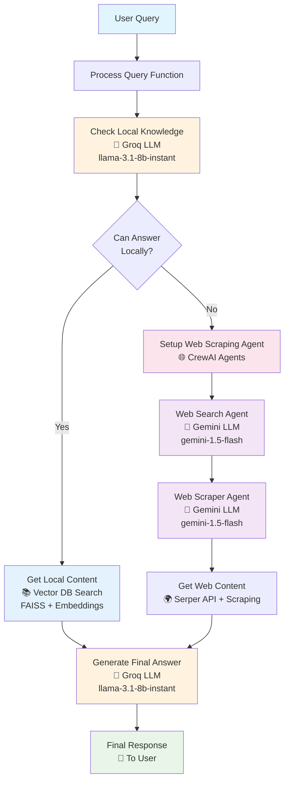
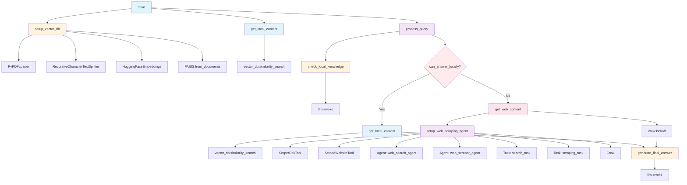

# Agentic RAG System

A sophisticated Retrieval-Augmented Generation (RAG) system that combines autonomous reasoning with intelligent information retrieval and generation capabilities.

## 🚀 Overview

This project implements an **Agentic RAG** system that goes beyond traditional RAG approaches by incorporating:

- **Autonomous Decision Making**: The system can independently determine when and how to retrieve information
- **Multi-Step Reasoning**: Breaks down complex queries into manageable tasks
- **Dynamic Information Retrieval**: Adapts retrieval strategy based on context and quality
- **Self-Reflection**: Evaluates and corrects its own outputs
- **Tool Integration**: Seamlessly integrates with web scraping and search APIs

## 🏗️ Architecture

The system consists of four main components:

1. **Agent Framework**: Task decomposition, memory management, and tool integration
2. **Retrieval System**: Vector database with semantic search capabilities
3. **Generation System**: LLM integration with prompt optimization
4. **Orchestration Layer**: Workflow management and error handling

## 🔄 System Flow Diagram



### LLM Usage Breakdown

| Step | LLM Used | Purpose | Model |
|------|----------|---------|-------|
| **Routing Decision** | Groq | Determines if local knowledge is sufficient | `llama-3.1-8b-instant` |
| **Local Retrieval** | Embeddings | Semantic search in vector database | `sentence-transformers/all-mpnet-base-v2` |
| **Web Search** | Gemini | Identifies relevant web sources | `gemini-1.5-flash` |
| **Web Scraping** | Gemini | Extracts and analyzes web content | `gemini-1.5-flash` |
| **Final Generation** | Groq | Generates comprehensive answer | `llama-3.1-8b-instant` |

## 🔧 Function Call Flow Diagram



### Function Call Hierarchy

```
main()
├── setup_vector_db(pdf_path)
│   ├── PyPDFLoader(pdf_path)
│   ├── RecursiveCharacterTextSplitter()
│   ├── HuggingFaceEmbeddings()
│   └── FAISS.from_documents()
│
├── get_local_content(vector_db, "")
│   └── vector_db.similarity_search()
│
└── process_query(query, vector_db, local_context)
    ├── check_local_knowledge(query, local_context)
    │   └── llm.invoke(formatted_prompt)
    │
    ├── [IF can_answer_locally]
    │   └── get_local_content(vector_db, query)
    │       └── vector_db.similarity_search()
    │
    ├── [ELSE]
    │   └── get_web_content(query)
    │       └── setup_web_scraping_agent()
    │           ├── SerperDevTool()
    │           ├── ScrapeWebsiteTool()
    │           ├── Agent(web_search_agent)
    │           ├── Agent(web_scraper_agent)
    │           ├── Task(search_task)
    │           ├── Task(scraping_task)
    │           ├── Crew()
    │           └── crew.kickoff()
    │
    └── generate_final_answer(context, query)
        └── llm.invoke(messages)
```

### Key Function Descriptions

| Function | Purpose | Parameters | Returns |
|----------|---------|------------|---------|
| `main()` | Entry point, orchestrates the entire process | None | None |
| `setup_vector_db()` | Creates FAISS vector database from PDF | `pdf_path` | `vector_db` |
| `get_local_content()` | Retrieves relevant chunks from vector DB | `vector_db`, `query` | `str` (context) |
| `process_query()` | Main processing logic with routing | `query`, `vector_db`, `local_context` | `str` (answer) |
| `check_local_knowledge()` | Determines if local knowledge is sufficient | `query`, `context` | `bool` |
| `get_web_content()` | Orchestrates web scraping via CrewAI | `query` | `str` (web content) |
| `setup_web_scraping_agent()` | Creates CrewAI agents and tasks | None | `Crew` object |
| `generate_final_answer()` | Generates final response using LLM | `context`, `query` | `str` (answer) |

## 📋 Features

- **Intelligent Routing**: Determines whether to use local knowledge or web scraping
- **Vector Database**: FAISS-based semantic search on PDF documents
- **Multi-Agent System**: CrewAI-powered agents for web search and scraping
- **Context-Aware Responses**: Maintains context across multiple interactions
- **API Integration**: Groq LLM and Google Gemini for different tasks

## 🛠️ Installation

### Prerequisites

- Python 3.8+
- Virtual environment (recommended)

### Setup

1. **Clone the repository**
   ```bash
   git clone <repository-url>
   cd agentic_rag_datacamp
   ```

2. **Create and activate virtual environment**
   ```bash
   # Windows
   python -m venv venv
   venv\Scripts\activate
   
   # macOS/Linux
   python -m venv venv
   source venv/bin/activate
   ```

3. **Install dependencies**
   ```bash
   pip install python-dotenv langchain langchain-community langchain-text-splitters langchain-huggingface langchain-groq crewai crewai-tools faiss-cpu sentence-transformers reportlab
   ```

4. **Set up environment variables**
   
   Create a `.env` file in the project root:
   ```env
   GROQ_API_KEY=your_groq_api_key_here
   SERPER_API_KEY=your_serper_api_key_here
   GEMINI=your_google_gemini_api_key_here
   ```

   **API Keys Required:**
   - [Groq API Key](https://console.groq.com/) - For LLM inference
   - [Serper API Key](https://serper.dev/) - For web search functionality
   - [Google Gemini API Key](https://makersuite.google.com/) - For CrewAI agents

## 🚀 Usage

### Basic Usage

1. **Prepare your knowledge base**
   - Place your PDF file in the project directory
   - Update the `pdf_path` variable in `app.py` if needed

2. **Run the application**
   ```bash
   python app.py
   ```

### Customization

#### Adding New Documents

1. Place your PDF file in the project directory
2. Update the `pdf_path` variable in the `main()` function:
   ```python
   pdf_path = "your-document.pdf"
   ```

#### Modifying Queries

Change the example query in the `main()` function:
   ```python
   query = "Your custom question here"
   ```

#### Adjusting Model Parameters

Modify the LLM configuration in `app.py`:
   ```python
   llm = ChatGroq(
       model="llama-3.1-8b-instant",  # Change model as needed
       temperature=0,                  # Adjust creativity (0-1)
       max_tokens=500,                 # Adjust response length
   )
   ```

## 📁 Project Structure

```
agentic_rag_datacamp/
├── app.py                    # Main application file
├── genai-principles.pdf      # Sample knowledge base
├── .env                      # Environment variables (not tracked)
├── README.md                 # This file
└── requirements.txt          # Dependencies (optional)
```

## 🔧 Configuration

### Model Selection

The system uses different models for different tasks:

- **Primary LLM**: Groq's `llama-3.1-8b-instant` for routing and generation
- **CrewAI LLM**: Google's `gemini-1.5-flash` for agent tasks
- **Embeddings**: `sentence-transformers/all-mpnet-base-v2` for vector search

### Performance Tuning

- **Chunk Size**: Adjust `chunk_size` in `RecursiveCharacterTextSplitter` (default: 1000)
- **Retrieval Count**: Modify `k` parameter in `similarity_search` (default: 5)
- **Temperature**: Control response creativity (0 = deterministic, 1 = creative)

## 🧪 Testing

Test the system with different types of queries:

```python
# Local knowledge queries
query = "What is Agentic RAG?"

# Web-dependent queries  
query = "What are the latest developments in AI?"

# Complex multi-step queries
query = "Compare Agentic RAG with traditional RAG systems"
```

## 🐛 Troubleshooting

### Common Issues

1. **Model Decommissioned Error**
   ```
   Error: The model has been decommissioned
   ```
   **Solution**: Update the model name in `app.py` to a current Groq model

2. **Missing PDF File**
   ```
   ValueError: File path is not a valid file
   ```
   **Solution**: Ensure the PDF file exists in the project directory

3. **API Key Issues**
   ```
   AuthenticationError: Invalid API key
   ```
   **Solution**: Verify your API keys in the `.env` file

4. **Import Errors**
   ```
   ModuleNotFoundError: No module named 'crewai_tools'
   ```
   **Solution**: Install missing dependencies with `pip install`

### Performance Issues

- **Slow Vector Search**: Reduce chunk size or use smaller embedding model
- **High Memory Usage**: Decrease `max_tokens` or use smaller LLM model
- **API Rate Limits**: Add delays between requests or upgrade API plans

## 🤝 Contributing

1. Fork the repository
2. Create a feature branch (`git checkout -b feature/amazing-feature`)
3. Commit your changes (`git commit -m 'Add amazing feature'`)
4. Push to the branch (`git push origin feature/amazing-feature`)
5. Open a Pull Request

### Development Guidelines

- Follow PEP 8 style guidelines
- Add docstrings to new functions
- Include type hints where appropriate
- Test with different document types and queries

## 📄 License

This project is licensed under the MIT License - see the [LICENSE](LICENSE) file for details.

## 🙏 Acknowledgments

- [LangChain](https://github.com/langchain-ai/langchain) for the RAG framework
- [CrewAI](https://github.com/joaomdmoura/crewAI) for multi-agent orchestration
- [Groq](https://groq.com/) for fast LLM inference
- [Hugging Face](https://huggingface.co/) for embedding models

## 📞 Support

If you encounter any issues or have questions:

1. Check the [Issues](https://github.com/your-username/agentic_rag_datacamp/issues) page
2. Create a new issue with detailed information
3. Include error messages and system information

## 🔮 Future Enhancements

- [ ] Support for multiple document formats (DOCX, TXT, HTML)
- [ ] Real-time web scraping with browser automation
- [ ] Multi-modal support (images, audio)
- [ ] Advanced caching mechanisms
- [ ] REST API interface
- [ ] Web dashboard for interaction
- [ ] Integration with more LLM providers
- [ ] Advanced evaluation metrics

---

**⭐ Star this repository if you find it helpful!**
