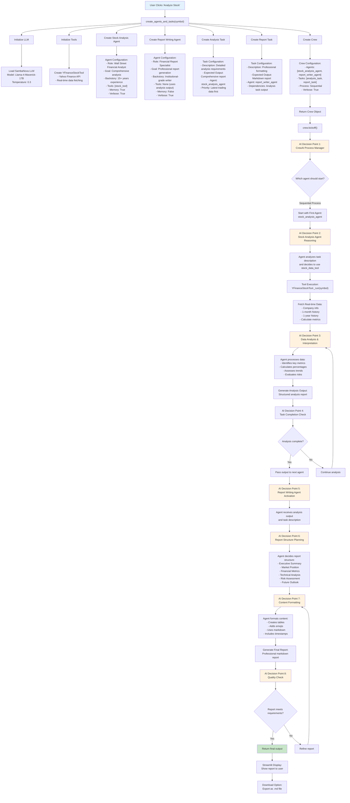
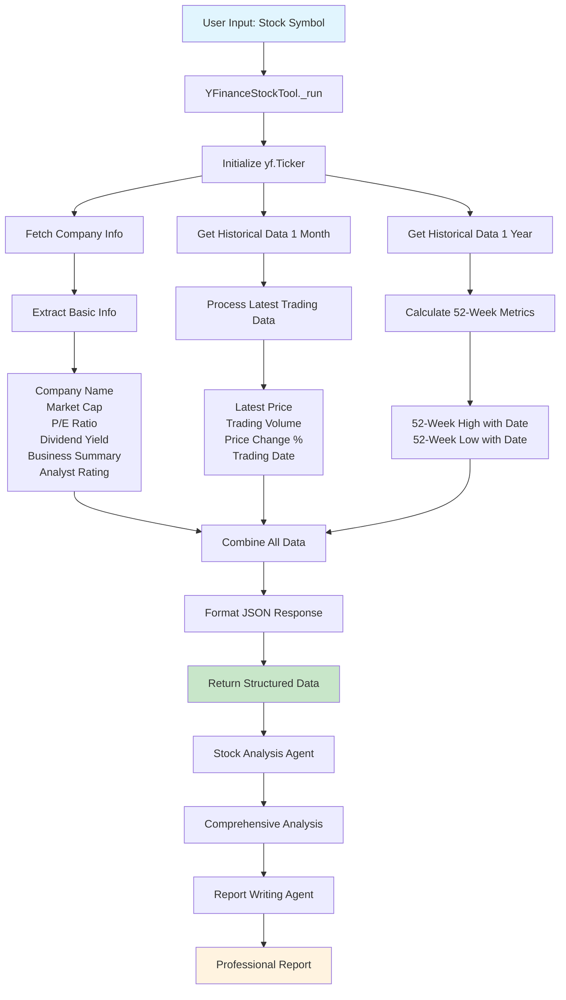

# 🎯 Multi-Agent AI Financial Analyst

A powerful multi-agent system that performs comprehensive stock analysis and generates detailed financial reports using CrewAI and real-time market data.

## 🚀 Features

- **Multi-Agent Architecture**: Two specialized AI agents working in sequence
- **Real-time Data Integration**: Live market data via Yahoo Finance API
- **Comprehensive Analysis**: Fundamental and technical analysis with 52-week performance tracking
- **Professional Reports**: Structured markdown reports with visual indicators
- **Interactive Interface**: User-friendly Streamlit web application
- **Downloadable Reports**: Export analysis reports in markdown format

## 🧠 Understanding CrewAI: How Agentic AI Works

### What is CrewAI? 🤔

Think of CrewAI as a **team manager** for AI agents. Just like in a real company where you have different specialists (a data analyst, a report writer, a project manager), CrewAI lets you create a team of AI "workers" that each have specific skills and can work together to complete complex tasks.

### The Simple Analogy 🏢

Imagine you're running a financial consulting firm:

1. **The Data Analyst** (Stock Analysis Agent)
   - Knows how to read financial data
   - Understands market trends
   - Can interpret complex numbers
   - **Job**: Gather and analyze stock information

2. **The Report Writer** (Report Writing Agent)
   - Takes the analyst's findings
   - Structures them into readable reports
   - Makes complex data understandable
   - **Job**: Create professional reports for clients

3. **The Manager** (CrewAI Framework)
   - Assigns tasks to the right specialist
   - Ensures work flows in the correct order
   - Manages the handoff between team members
   - **Job**: Coordinate the entire process

### How CrewAI Works in Simple Terms 🔄

```
1. You give a task: "Analyze Apple stock"
   ↓
2. CrewAI looks at the task and says: "I need my data analyst first"
   ↓
3. Data Analyst works: "Let me get the latest Apple stock data..."
   ↓
4. Data Analyst finishes: "Here's my analysis with all the numbers"
   ↓
5. CrewAI says: "Now I need my report writer to make this readable"
   ↓
6. Report Writer works: "Let me turn this into a professional report..."
   ↓
7. Report Writer finishes: "Here's your final report!"
   ↓
8. You get: A complete, professional stock analysis
```

### Key CrewAI Concepts Made Simple 📚

#### **Agents** = Specialized Workers
- Each agent has a specific role and expertise
- Like hiring a specialist for each part of the job
- They know what tools to use and how to think

#### **Tasks** = Job Assignments
- Clear instructions for what each agent should do
- Like giving a detailed job description
- Includes what the expected output should look like

#### **Tools** = Equipment/Resources
- Specialized tools each agent can use
- Like giving a carpenter a hammer or a chef a knife
- In our case: Yahoo Finance API for getting stock data

#### **Crew** = The Team
- The collection of agents working together
- Like assembling a project team
- CrewAI manages how they work together

#### **Process** = Workflow
- How the agents work together (one after another, or in parallel)
- Like deciding if workers should take turns or work simultaneously

### Why Use CrewAI Instead of One Big AI? 🤷‍♂️

**Traditional Approach:**
- One AI tries to do everything
- Like asking one person to be an expert in everything
- Often produces mediocre results

**CrewAI Approach:**
- Multiple specialized AIs
- Each expert in their specific area
- Better results because each agent is focused and skilled

### Real-World Example: Our Financial Analyst 🏦

In our project:

1. **Stock Analysis Agent** = The Financial Expert
   - **Knows**: How to read financial data, market trends, risk assessment
   - **Uses**: Yahoo Finance tool to get real data
   - **Produces**: Detailed analysis with numbers and insights

2. **Report Writing Agent** = The Communication Expert
   - **Knows**: How to write professional reports, format data, create tables
   - **Uses**: The analysis from the first agent
   - **Produces**: Clean, readable, professional report

3. **CrewAI** = The Project Manager
   - **Coordinates**: Makes sure the analysis agent finishes before the report agent starts
   - **Manages**: Handles the data flow between agents
   - **Ensures**: Quality control and proper sequencing

### The Magic of Agentic AI ✨

**Agentic AI** means AI that can:
- **Plan**: Figure out what steps are needed
- **Act**: Take actions using tools and resources
- **Decide**: Make choices about how to proceed
- **Collaborate**: Work with other AI agents
- **Adapt**: Change approach based on results

It's like having a team of smart assistants that can work independently but also coordinate with each other to solve complex problems.

## 🔧 Low-Level Design (LLD) for CrewAI Implementation

### Detailed System Flow and AI Decision Points



### Key AI Decision Points in CrewAI

#### 1. **Process Management (CrewAI Framework)**
- **Decision**: Which agent should execute first?
- **AI Logic**: Sequential process means first agent in the list
- **Without User Specifying**: CrewAI automatically determines execution order

#### 2. **Tool Selection (Stock Analysis Agent)**
- **Decision**: Which tool to use for data gathering?
- **AI Logic**: Agent analyzes task description and selects appropriate tool
- **Without User Specifying**: Agent autonomously chooses `stock_data_tool`

#### 3. **Data Interpretation (Stock Analysis Agent)**
- **Decision**: How to analyze and interpret the fetched data?
- **AI Logic**: Agent uses its backstory and expertise to process data
- **Without User Specifying**: Agent makes independent analytical decisions

#### 4. **Report Structure Planning (Report Writing Agent)**
- **Decision**: How to structure the final report?
- **AI Logic**: Agent analyzes task requirements and creates optimal structure
- **Without User Specifying**: Agent autonomously designs report layout

#### 5. **Content Formatting (Report Writing Agent)**
- **Decision**: How to present data effectively?
- **AI Logic**: Agent chooses formatting, tables, emojis based on context
- **Without User Specifying**: Agent makes creative formatting decisions

### Where Artificial Intelligence Comes Into Play

#### **LLM Integration Points:**
1. **Agent Reasoning**: Each agent uses the LLM to understand tasks and make decisions
2. **Content Generation**: LLM generates analysis and report content
3. **Tool Usage**: LLM decides when and how to use available tools
4. **Quality Assessment**: LLM evaluates if outputs meet requirements
5. **Adaptive Behavior**: LLM adapts responses based on data and context

#### **Autonomous Decision Making:**
- **Tool Selection**: Agents choose appropriate tools without explicit instructions
- **Content Prioritization**: Agents decide what information is most important
- **Formatting Choices**: Agents make creative decisions about presentation
- **Error Handling**: Agents adapt when tools fail or data is incomplete
- **Quality Control**: Agents self-assess and refine their outputs

### CrewAI's Decisive Capabilities

#### **Without User Specifying:**
1. **Execution Order**: Determines which agent runs first
2. **Tool Usage**: Chooses which tools to use and when
3. **Content Focus**: Prioritizes which data points to emphasize
4. **Report Structure**: Designs optimal report layout
5. **Formatting Style**: Selects appropriate presentation methods
6. **Quality Standards**: Ensures outputs meet professional standards
7. **Error Recovery**: Handles failures and adapts approach
8. **Context Adaptation**: Adjusts behavior based on data quality and type

## 🏗️ Architecture

The system consists of two specialized AI agents:

### 1. **Stock Analysis Agent** 🧠
- **Role**: Wall Street Financial Analyst
- **Expertise**: 15+ years of equity research experience
- **Responsibilities**:
  - Fetches real-time market data using financial tools
  - Analyzes latest trading information and 52-week performance
  - Evaluates financial metrics (P/E ratio, market cap, etc.)
  - Performs technical analysis and risk assessment
  - Provides data-driven investment insights

### 2. **Report Writing Agent** 📝
- **Role**: Financial Report Specialist
- **Expertise**: Institutional-grade research report creation
- **Responsibilities**:
  - Transforms analysis into professional reports
  - Structures data with clear sections and tables
  - Adds visual indicators and formatting
  - Creates actionable insights and recommendations
  - Generates downloadable markdown reports

## 🔧 Financial Tools Workflow

The `financial_tools.py` module provides real-time market data through the `YFinanceStockTool`:



## 📊 Data Points Collected

The financial tool collects comprehensive market data including:

### Latest Trading Information
- Current stock price with specific date
- Percentage change from open
- Trading volume
- Market status indicators

### 52-Week Performance
- 52-week high with exact date
- 52-week low with exact date
- Current position relative to 52-week range
- Percentage calculations from highs and lows

### Financial Metrics
- Market capitalization
- P/E ratio (forward-looking)
- Dividend yield
- Business summary
- Analyst recommendations

## 🛠️ Installation

1. **Clone Repository & Navigate:**
   ```bash
   git clone https://github.com/Sumanth077/awesome-ai-apps-and-agents.git
   cd awesome-ai-apps-and-agents/multi_agent_financial_analyst
   ```

2. **Install Dependencies:**
   ```bash
   pip install -r requirements.txt
   ```

3. **Environment Setup:**
   Create a `.env` file in the root directory:
   ```bash
   SAMBANOVA_API_KEY=your_api_key_here
   ```

## 🚀 Usage

1. **Start the Application:**
   ```bash
   streamlit run financial_analyst.py
   ```

2. **Web Interface:**
   - Enter your SambaNova API key in the sidebar
   - Input a stock symbol (e.g., AAPL, GOOGL, MSFT)
   - Click "Analyze Stock" to initiate the analysis
   - Wait for the multi-agent analysis to complete
   - Review the comprehensive report
   - Download the report in markdown format

## 📋 Dependencies

- **CrewAI** (≥0.12.2): Multi-agent framework
- **Streamlit** (≥1.31.0): Web application framework
- **yfinance** (≥0.2.35): Yahoo Finance data integration
- **Pandas** (≥2.1.0): Data manipulation
- **Pydantic** (≥2.5.0): Data validation
- **python-dotenv** (≥1.0.0): Environment variable management
- **Plotly** (≥5.18.0): Data visualization

## 🔍 Analysis Process

1. **Data Collection**: Real-time market data via Yahoo Finance
2. **Agent Analysis**: Stock Analysis Agent processes the data
3. **Report Generation**: Report Writing Agent creates structured output
4. **User Review**: Interactive web interface for result review
5. **Export**: Downloadable markdown reports

## 📁 Project Structure

```
multi_agent_financial_analyst/
├── financial_analyst.py          # Main Streamlit application
├── tools/
│   └── financial_tools.py        # Yahoo Finance data integration
├── reports/                      # Generated analysis reports
├── requirements.txt              # Python dependencies
├── README.md                     # Project documentation
└── .env                         # Environment variables (create this)
```

## 🤝 Contributing

Contributions are welcome! Please feel free to submit a Pull Request.

## 📄 License

This project is licensed under the MIT License - see the LICENSE file for details.

## ⚠️ Disclaimer

This tool is for educational and research purposes only. It should not be considered as financial advice. Always consult with qualified financial professionals before making investment decisions. 
