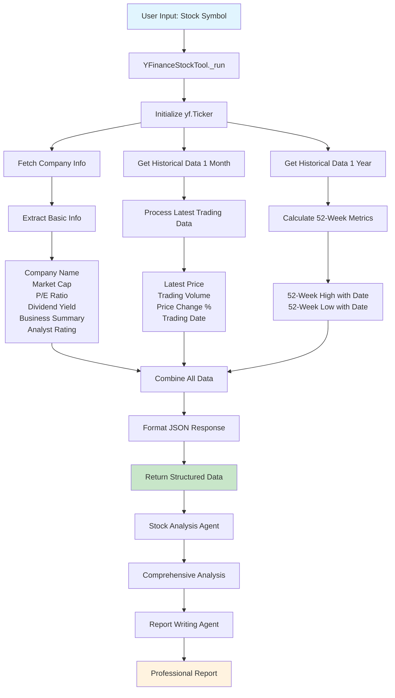

# 🎯 Multi-Agent AI Financial Analyst

A powerful multi-agent system that performs comprehensive stock analysis and generates detailed financial reports using CrewAI and real-time market data.

## 🚀 Features

- **Multi-Agent Architecture**: Two specialized AI agents working in sequence
- **Real-time Data Integration**: Live market data via Yahoo Finance API
- **Comprehensive Analysis**: Fundamental and technical analysis with 52-week performance tracking
- **Professional Reports**: Structured markdown reports with visual indicators
- **Interactive Interface**: User-friendly Streamlit web application
- **Downloadable Reports**: Export analysis reports in markdown format

## 🏗️ Architecture

The system consists of two specialized AI agents:

### 1. **Stock Analysis Agent** 🧠
- **Role**: Wall Street Financial Analyst
- **Expertise**: 15+ years of equity research experience
- **Responsibilities**:
  - Fetches real-time market data using financial tools
  - Analyzes latest trading information and 52-week performance
  - Evaluates financial metrics (P/E ratio, market cap, etc.)
  - Performs technical analysis and risk assessment
  - Provides data-driven investment insights

### 2. **Report Writing Agent** 📝
- **Role**: Financial Report Specialist
- **Expertise**: Institutional-grade research report creation
- **Responsibilities**:
  - Transforms analysis into professional reports
  - Structures data with clear sections and tables
  - Adds visual indicators and formatting
  - Creates actionable insights and recommendations
  - Generates downloadable markdown reports

## 🔧 Financial Tools Workflow

The `financial_tools.py` module provides real-time market data through the `YFinanceStockTool`:



## 📊 Data Points Collected

The financial tool collects comprehensive market data including:

### Latest Trading Information
- Current stock price with specific date
- Percentage change from open
- Trading volume
- Market status indicators

### 52-Week Performance
- 52-week high with exact date
- 52-week low with exact date
- Current position relative to 52-week range
- Percentage calculations from highs and lows

### Financial Metrics
- Market capitalization
- P/E ratio (forward-looking)
- Dividend yield
- Business summary
- Analyst recommendations

## 🛠️ Installation

1. **Clone Repository & Navigate:**
   ```bash
   cd multi_agent_financial_analyst
   ```

2. **Install Dependencies:**
   ```bash
   pip install -r requirements.txt
   ```

3. **Environment Setup:**
   Create a `.env` file in the root directory:
   ```bash
   SAMBANOVA_API_KEY=your_api_key_here
   ```

## 🚀 Usage

1. **Start the Application:**
   ```bash
   streamlit run financial_analyst.py
   ```

2. **Web Interface:**
   - Enter your SambaNova API key in the sidebar
   - Input a stock symbol (e.g., AAPL, GOOGL, MSFT)
   - Click "Analyze Stock" to initiate the analysis
   - Wait for the multi-agent analysis to complete
   - Review the comprehensive report
   - Download the report in markdown format

## 📋 Dependencies

- **CrewAI** (≥0.12.2): Multi-agent framework
- **Streamlit** (≥1.31.0): Web application framework
- **yfinance** (≥0.2.35): Yahoo Finance data integration
- **Pandas** (≥2.1.0): Data manipulation
- **Pydantic** (≥2.5.0): Data validation
- **python-dotenv** (≥1.0.0): Environment variable management
- **Plotly** (≥5.18.0): Data visualization

## 🔍 Analysis Process

1. **Data Collection**: Real-time market data via Yahoo Finance
2. **Agent Analysis**: Stock Analysis Agent processes the data
3. **Report Generation**: Report Writing Agent creates structured output
4. **User Review**: Interactive web interface for result review
5. **Export**: Downloadable markdown reports

## 📁 Project Structure

```
multi_agent_financial_analyst/
├── financial_analyst.py          # Main Streamlit application
├── tools/
│   └── financial_tools.py        # Yahoo Finance data integration
├── reports/                      # Generated analysis reports
├── requirements.txt              # Python dependencies
├── README.md                     # Project documentation
└── .env                         # Environment variables (create this)
```

## 🤝 Contributing

Contributions are welcome! Please feel free to submit a Pull Request.

## 📄 License

This project is licensed under the MIT License - see the LICENSE file for details.

## ⚠️ Disclaimer

This tool is for educational and research purposes only. It should not be considered as financial advice. Always consult with qualified financial professionals before making investment decisions. 
