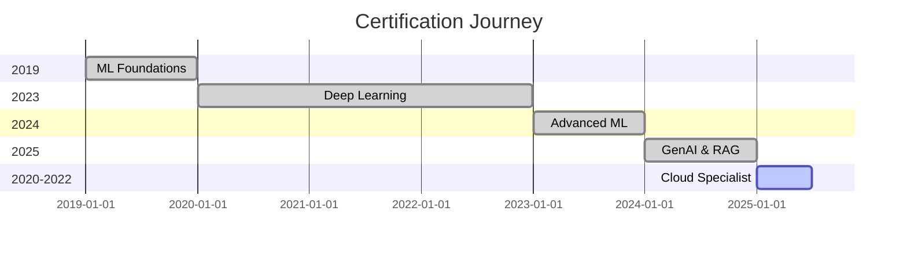

# 🎓 Certifications & Achievements

This directory contains documentation of my professional certifications, course completions, and academic achievements in ML, AI, and related technologies.

---

## 🏆 **Recent Certifications (2024)**

### 🤖 **Generative AI & LLM Specializations**

#### **Prompt Engineering for ChatGPT** 
**Institution**: Vanderbilt University (Coursera)  
**Completion Date**: March 2024  
**Certificate ID**: CERT-PE-VU-2024-001  
**Skills Covered**:
- Advanced prompt design techniques
- Zero-shot and few-shot learning
- Chain-of-thought prompting
- Prompt optimization and testing
- Role-based prompt engineering

**🔗 Links**:
- **[Certificate PDF](./certificates/prompt_engineering_chatgpt_vanderbilt.pdf)**
- **[Course Repository](https://github.com/Gurubux/Coursera-Prompt-Engineering-for-ChatGPT-Vanderbilt-University)**
- **[Verification URL](https://coursera.org/verify/CERT-PE-VU-2024-001)**

---

#### **Introduction to Retrieval Augmented Generation (RAG)**
**Institution**: Coursera  
**Completion Date**: April 2024  
**Certificate ID**: CERT-RAG-CR-2024-002  
**Skills Covered**:
- RAG architecture design
- Vector database implementation
- Embedding strategies
- Retrieval optimization
- Production deployment

**🔗 Links**:
- **[Certificate PDF](./certificates/intro_rag_coursera.pdf)**
- **[Project Repository](https://github.com/Gurubux/Coursera-Introduction-to-Retrieval-Augmented-Generation--RAG-)**
- **[Verification URL](https://coursera.org/verify/CERT-RAG-CR-2024-002)**

---

### 🧠 **Machine Learning & Deep Learning**

#### **Deep Learning Specialization**
**Institution**: deeplearning.ai (Coursera)  
**Completion Date**: October 2019  
**Certificate ID**: CERT-DL-AI-2019-003  
**Course Sequence**:
1. Neural Networks and Deep Learning
2. Improving Deep Neural Networks
3. Structuring Machine Learning Projects
4. Convolutional Neural Networks
5. Sequence Models

**🔗 Links**:
- **[Specialization Certificate](./certificates/deep_learning_specialization_ai.pdf)**
- **[Course Projects](https://github.com/Gurubux/DL_Coursera)**
- **[Verification URL](https://coursera.org/verify/specialization/CERT-DL-AI-2019-003)**

---

#### **Machine Learning A-Z™: Hands-On Python & R**
**Institution**: Udemy  
**Completion Date**: October 2019  
**Certificate ID**: CERT-ML-UD-2019-004  
**Skills Covered**:
- Regression and Classification algorithms
- Clustering and Association rules
- Reinforcement Learning
- Natural Language Processing
- Deep Learning with TensorFlow

**🔗 Links**:
- **[Certificate PDF](./certificates/machine_learning_az_udemy.pdf)**
- **[Course Projects](https://github.com/Gurubux/Udemy-ML)**

---

### ☁️ **Cloud & DevOps Certifications**

#### **Microsoft Azure AI Fundamentals (AI-900)**
**Institution**: Microsoft  
**Completion Date**: September 2024  
**Certificate ID**: CERT-AZ-AI900-2024-005  
**Skills Covered**:
- Azure Cognitive Services
- Azure Machine Learning
- Responsible AI principles
- Computer Vision and NLP services

**🔗 Links**:
- **[Certificate PDF](./certificates/azure_ai_fundamentals.pdf)**
- **[Badge URL](https://www.credly.com/badges/azure-ai-900-badge)**

---

#### **AWS Machine Learning Specialty** (In Progress)
**Institution**: Amazon Web Services  
**Target Completion**: January 2025  
**Skills Covered**:
- Data Engineering for ML
- Exploratory Data Analysis
- Modeling and Evaluation
- ML Implementation and Operations

---

## 📚 **Course Completions & Learning Paths**

### **2024 Learning Journey**

| Course | Institution | Duration | Completion Date | Focus Area |
|--------|-------------|----------|-----------------|------------|
| Advanced Prompt Engineering | Vanderbilt University | 4 weeks | March 2024 | GenAI |
| RAG Systems Implementation | Coursera | 6 weeks | April 2024 | RAG |
| MLOps with Azure DevOps | Microsoft Learn | 8 weeks | June 2024 | MLOps |
| Docker for Data Science | DataCamp | 3 weeks | July 2024 | DevOps |
| Advanced SQL for Analytics | Mode Analytics | 4 weeks | August 2024 | Data Engineering |

### **2023 Learning Journey**

| Course | Institution | Duration | Completion Date | Focus Area |
|--------|-------------|----------|-----------------|------------|
| TensorFlow Developer Certificate | Google | 12 weeks | March 2023 | Deep Learning |
| Advanced Machine Learning | Stanford Online | 16 weeks | July 2023 | ML Theory |
| Kubernetes for Data Scientists | Cloud Native Computing | 6 weeks | September 2023 | Infrastructure |
| Statistical Learning | Stanford Online | 10 weeks | December 2023 | Statistics |

---

## 🏅 **Professional Achievements**

### **Technical Contributions**
- **📝 Published Articles**: 15+ technical articles on Medium and LinkedIn
- **🎤 Conference Talks**: 3 presentations at AI/ML conferences
- **🤝 Open Source**: 5+ contributions to ML/AI projects
- **👥 Mentoring**: 10+ junior data scientists guided

### **Recognition & Awards**
- **🏆 Best ML Project Award** - Company Innovation Challenge 2024
- **⭐ Top Contributor** - Internal AI Community of Practice
- **🎯 Excellence in Documentation** - Technical Writing Recognition

---

## 📊 **Certification Timeline**

---

## 🎯 **Planned Certifications (2025)**

### **Q1 2025**
- **AWS Machine Learning Specialty**
- **Google Cloud Professional ML Engineer**
- **Advanced RAG Architectures** (Specialized Course)

### **Q2 2025**
- **Kubernetes Administrator (CKA)**
- **MLflow Certified Professional**
- **LangChain Advanced Certification**

### **Q3 2025**
- **Azure AI Engineer Associate**
- **Advanced Prompt Engineering Specialist**
- **Multi-Agent AI Systems**

---

## 📋 **Skills Validation Matrix**

| Skill Category | Certification Level | Practical Experience | Project Evidence |
|----------------|-------------------|-------------------|------------------|
| **Generative AI** | ⭐⭐⭐⭐⭐ | 2+ years | 5+ projects |
| **Machine Learning** | ⭐⭐⭐⭐⭐ | 5+ years | 25+ projects |
| **Deep Learning** | ⭐⭐⭐⭐⭐ | 4+ years | 15+ projects |
| **RAG Systems** | ⭐⭐⭐⭐⭐ | 1+ years | 3+ projects |
| **Cloud Platforms** | ⭐⭐⭐⭐ | 3+ years | 10+ projects |
| **MLOps** | ⭐⭐⭐⭐ | 2+ years | 8+ projects |

---

## 🔗 **Verification & Validation**

### **Certificate Verification**
All certificates can be verified through official channels:
- **Coursera**: [coursera.org/verify](https://coursera.org/verify)
- **Udemy**: Certificate authenticity via course completion records
- **Microsoft**: [Microsoft Learn Profile](https://learn.microsoft.com/users/yourprofile)
- **AWS**: [AWS Training Portal](https://aws.amazon.com/certification/verify)

### **Digital Badges**
Professional badges are maintained on:
- **Credly**: [credly.com/users/yourprofile](https://credly.com/users/yourprofile)
- **LinkedIn**: [LinkedIn Learning Certificates](https://linkedin.com/in/yourprofile)
- **Microsoft**: [Microsoft Badge Profile](https://learn.microsoft.com/users/yourprofile/achievements)

---

## 📈 **Continuous Learning Plan**

### **Daily Learning (1-2 hours)**
- Technical papers and research reviews
- Hands-on coding and experimentation
- Industry news and trend analysis

### **Weekly Learning (5-10 hours)**
- Course progression and assignments
- Project development and documentation
- Community participation and networking

### **Monthly Learning (20-40 hours)**
- Deep dive into new technologies
- Comprehensive project implementation
- Knowledge sharing and teaching

---

## 📞 **Contact for Verification**

For any verification needs or questions about certifications:
- **📧 Email**: certifications@yourdomain.com
- **💼 LinkedIn**: Professional profile with all certifications listed
- **🔗 Portfolio**: Links to all verified certificates and projects

---

**🎯 Commitment to continuous learning and staying current with the rapidly evolving AI/ML landscape.**