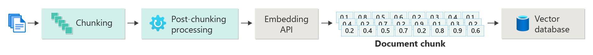
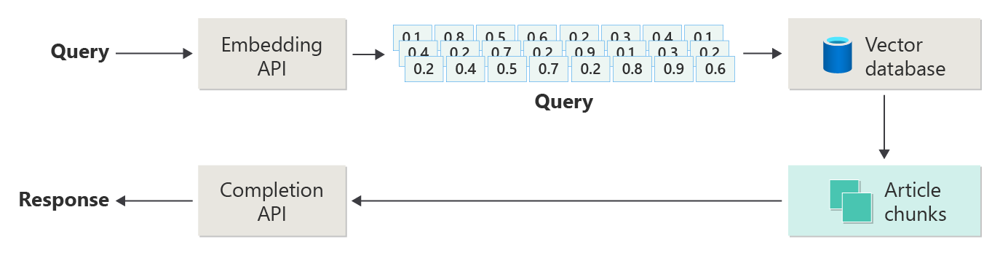
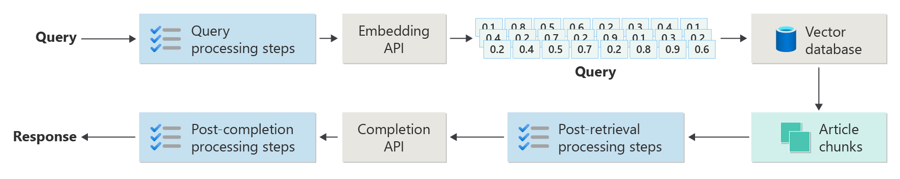

# Deloitte Preparation

https://www.linkedin.com/posts/pinaki-singha-roy-263627138_deloitte-interview-questions-for-data-science-activity-7232371546365779968-IDpB/  
https://nodeflair.com/companies/deloitte/interviews/senior-data-scientist  
https://www.interviewquery.com/interview-guides/deloitte-data-scientist

_I CAN GET THE JOB and I WILL  
BUILD STRONG RELATIONSHIP with INTERVIEWER_

# How I am going to prepare

1. What I know from JD, prepare strong for what I know
2. What I don't know from JD, prepare for what I can
3. Prepare for Why Deloitte, Why Consulting, Why this department
4. Prepare for Domain Knowledge Audit/Assurance
5. Prepare for Behavioural Questions
6. Prepare for Business Case Study Questions

# 1. WHAT I KNOW FROM JD

- problem-solving skills
- capable of generating original solutions to real-world problems.
- coaching junior data scientists/analysts
- reviewing code and documentation to a high standard.
- Python (pandas, numpy, scikit-learn).
- End-to-end experience of
    - managing
    - multiple data science and analytics projects in
    - different industries and
    - with different types of data (text, numerical, categorical).
- Experience in project management
- Experience in a DevOps environment
- cloud environment - Azure, AWS
- Git
- Excel, SQL
- Docker
- Range of machine learning techniques (Supervised and unsupervised).
- Strong communication and data presentation skill
    - With the ability to build convincing recommendations
    - Sell these to a non-technical audience.
- Self-driven, able to work independently yet acts as a team player
- Able to apply data science principles through a business lens.
- Experience delivery data science for financial industry or large/complex organisations.

### 1.1 "Explain SHAP to a non-technical partner in 60 seconds with a finance example."

**Answer (60-second partner-friendly):**

> “In Railofy, we built a model that predicts whether a train ticket will get confirmed. Each day, about 10,000 PNRs go
> through the system and the prediction feeds directly into the pricing of insurance. The risk for us was *false
positives* — if the model said a ticket was highly likely to confirm but it didn’t, the company had to pay out, which
> hit our bottom line.
>
> To build trust in the model, we used SHAP — a tool that explains predictions in simple terms. Think of it like an
> itemised bill: for each ticket, SHAP shows how much each factor — such as travel date, route, or waitlist position —
> pushed the prediction up or down. We presented this visually on dashboards with “what-if” sliders, so leaders could
> test
> scenarios and see how changing one factor, like route, affected the outcome.
>
> This helped our COO and CPO see whether a ‘false positive’ was due to a rare situation the model couldn’t yet handle,
> or whether we needed to tighten thresholds. As a result, we introduced a risk-mitigation model that adjusted
> probability
> cut-offs, reducing losses while keeping transparency high.”

---

⚡ Why this works:

* Uses **finance language**: “bottom line,” “payout,” “thresholds,” “risk mitigation.”
* Explains SHAP as an **itemised bill** → easy metaphor.
* Anchors in **business impact**: model trust + financial protection.
* Stays under \~200 words (\~55–60 seconds when spoken).

--- 

# 2. WHAT I HAVE TO PREPARE

## 2.1 Azure

## 2.2 Mathematics, Pprobability, and Statistics.

#### 📌 Mathematics (10 Q\&A)

**Q1. Why do we use linear algebra in machine learning?**  
👉 Linear algebra helps us organize and process data in tables (matrices). Think of it as Excel on steroids. In audit,
matrices let us handle thousands of transactions at once for fraud detection.

**Q2. What is an eigenvalue/eigenvector, and why do we care?**  
👉 Imagine you’re stretching a rubber band. Eigenvectors are the directions that don’t twist, just stretch; eigenvalues
tell us how much. In audit, this helps reduce dimensions (PCA) to find hidden patterns in financial data.

**Q3. What is the difference between convex and non-convex functions?**  
👉 Convex = a bowl shape, always one lowest point. Non-convex = hills and valleys, many traps. In ML, convex loss is
easier to optimize (like minimizing audit error).

**Q4. Why is gradient descent important?**  
👉 It’s like rolling a ball down a hill until it finds the lowest valley. In audit ML, it helps models learn from
discrepancies in financial data.

**Q5. What’s the difference between L1 and L2 regularization?**  
👉 L1 = makes some weights exactly zero (feature selection, like ignoring irrelevant audit factors).
L2 = makes weights small but not zero (smooths model, avoids overfitting).

**Q6. What is the difference between continuous and discrete variables?**  
👉 Continuous = flowing water (revenue amount). Discrete = marbles (number of invoices). In assurance, you track both.

**Q7. Explain vectors vs scalars in simple terms.**  
👉 Scalar = one number (profit this year). Vector = a list of numbers (profit for each month). Auditors often work with
vectors.

**Q8. What’s a dot product?**  
👉 Multiply matching parts of two lists and add them. Like scoring transactions by multiplying “risk factor” × “weight.”

**Q9. Why do we normalize data?**  
👉 Imagine comparing salaries in dollars and cents vs age in years. Without scaling, the big numbers dominate. In audit
ML, normalization ensures fair comparisons.

**Q10. What is the difference between supervised and unsupervised learning mathematically?**  
👉 Supervised = equation with both input (X) and output (Y). Unsupervised = only input (X), no answer key. In audit,
supervised detects known fraud, unsupervised finds unknown anomalies.

---

#### 🎲 Probability (10 Q\&A)

**Q1. What is probability in simplest terms?**  
👉 Probability = chance of something happening. Like flipping a coin = 50/50. In audit, it’s chance a transaction is
fraudulent.

**Q2. What is conditional probability?**  
👉 It’s the chance of an event given another event. Example: “If the company is in healthcare, what’s the chance of
revenue manipulation?”

**Q3. What’s Bayes’ Theorem and why do we care in audit?**  
👉 Bayes updates beliefs when new evidence arrives. In audit, you may think fraud risk = 5%, but after seeing suspicious
journal entries, update risk = 60%.

**Q4. Explain independence in probability.**  
👉 Two events are independent if one doesn’t affect the other. Like rolling two dice. In audit, two transactions are
independent if one doesn’t influence the other.

**Q5. What is expectation in probability?**  
👉 Expectation = average outcome if repeated many times. Example: Expected value of claims per policy. Auditors use it to
estimate financial risk.

**Q6. What’s the difference between variance and standard deviation?**  
👉 Variance = how spread out numbers are. Standard deviation = square root of variance (easier to understand scale). In
audit, used to measure risk spread.

**Q7. What’s the Law of Large Numbers?**  
👉 The more samples you take, the closer the average gets to the truth. In audit, sampling 1,000 invoices gives better
accuracy than just 10.

**Q8. What is the Central Limit Theorem?**  
👉 No matter the distribution, if you take large samples, the averages form a bell curve. Auditors use this for
hypothesis testing.

**Q9. What’s the difference between permutation and combination?**  
👉 Permutation = order matters (arranging audit reports). Combination = order doesn’t matter (choosing 5 invoices from
100).

**Q10. What’s overfitting in probability terms?**  
👉 When a model learns noise as if it’s signal. In audit, that’s like concluding fraud just because of random
coincidences in small samples.

---

#### 📊 Statistics (10 Q\&A)

**Q1. What’s the difference between descriptive and inferential statistics?**  
👉 Descriptive = summarize what happened (average revenue). Inferential = predict/explain (likelihood next year’s revenue
changes).

**Q2. What’s correlation vs causation?**  
👉 Correlation = two things move together (ice cream sales ↑, pool accidents ↑). Causation = one causes the other (ice
cream doesn’t cause drowning). Auditors must avoid false assumptions.

**Q3. What is p-value in simple terms?**  
👉 P-value = probability results happened by chance. Low p-value (<0.05) = unlikely random. In audit, it tests if
anomalies are real.

**Q4. What is hypothesis testing?**  
👉 It’s a way to test ideas with data. Example: “Is expense reporting fraud more likely in Q4?”

**Q5. What’s the difference between Type I and Type II error?**  
👉 Type I = false alarm (flagging normal transaction as fraud).
Type II = missed alarm (ignoring fraud). In audit, Type II is riskier.

**Q6. Explain confidence interval in simple terms.**  
👉 It’s like saying, “I’m 95% sure company profit is between £5M–£7M.”

**Q7. What is regression analysis?**  
👉 Regression shows how one variable affects another. In audit, predicting expense growth from revenue growth.

**Q8. What is multicollinearity and why is it bad?**  
👉 When predictors are highly related (e.g., revenue & sales count). Model gets confused. In audit ML, can overstate
risk.

**Q9. What is an outlier, and why does it matter?**  
👉 Outlier = unusual data point. Example: one invoice of £10M when all others are £10K. Auditors investigate outliers for
fraud risk.

**Q10. What’s the difference between population and sample?**  
👉 Population = all transactions. Sample = subset checked by auditor. Good sampling ensures conclusions apply to the
whole population.

---

## 2.3 LLM

### Large Language Models,

### Generative AI frameworks,

### Prompt engineering

**[Coursera-Prompt-Engineering-for-ChatGPT-Vanderbilt-University](https://github.com/Gurubux/Coursera-Prompt-Engineering-for-ChatGPT-Vanderbilt-University)**

### Fine tuning

```python
# Upload fine-tuning files

import os
from openai import OpenAI

client = OpenAI(
    api_key=os.getenv("AZURE_OPENAI_API_KEY"),
    base_url="https://YOUR-RESOURCE-NAME.openai.azure.com/openai/v1/"
)

training_file_name = 'training_set.jsonl'
validation_file_name = 'validation_set.jsonl'

# Upload the training and validation dataset files to Azure OpenAI with the SDK.

training_response = client.files.create(
    file=open(training_file_name, "rb"), purpose="fine-tune"
)
training_file_id = training_response.id

validation_response = client.files.create(
    file=open(validation_file_name, "rb"), purpose="fine-tune"
)
validation_file_id = validation_response.id

print("Training file ID:", training_file_id)
print("Validation file ID:", validation_file_id)
```

### Resource augmentation (RAG).

    
Retrieval-augmented generation (RAG)  

Build advanced Retrieval-augmented generation systems  (RAG)  


### 🛡️ Guardrails & Compliance Built into the LLM Review System

**1. Data Governance & Security**

* **Access controls & encryption** → restricted user roles (Medical, Legal, Regulatory reviewers).
* **No leakage of proprietary Pharma documents** → sandboxed processing, no external API calls.
* **Audit logs** for every claim review, preserving full traceability.

**2. Regulatory Alignment**

* **ABPI (UK Code of Practice), FDA (US promotional materials), EMA (EU guidelines)** aligned → ensured claims were
  evidence-backed.
* **Reference-only validation** → every claim had to cite **peer-reviewed literature or approved product label**; no
  hallucinations allowed.
* **Critical rule** → *marketing claim itself could never be treated as evidence*.

**3. Explainability & Transparency**

* **Structured outputs** → claim, reference match, decision (supported/not supported), rationale.
* **Verbatim references extracted** from source documents for audit-ready evidence.
* **Confidence scores & limitations flagged** where reference data was weak.

**4. Bias & Accuracy Controls**

* **Hallucination guardrails** → LLM fine-tuned with prompt constraints to avoid unverifiable outputs.
* **Cross-validation with multiple sources** (papers, regulatory websites).
* **Human-in-the-loop review** → final sign-off always by MLR team.

**5. Governance & Auditability**

* **Version control of model + prompts** → trace which model version reviewed which deck.
* **Documented SOPs** for LLM use, review escalation, and exception handling.
* **Continuous monitoring** of outputs against gold-standard reference datasets.

---

### 🎯 Keywords Deloitte will like:

* **MLR compliance, ABPI, FDA, EMA, audit logs, explainability, human-in-the-loop, bias control, data governance,
  transparency, ethical AI, traceability.**

---

## 2.4 Deep Learning (e.g. RNNs, CNNs)

### **2.4.1. Basics of Neural Network (NN)**

#### 🧠 Layman’s Explanation:

* Imagine your brain is full of light switches (neurons). Each switch decides if it should turn ON (1) or stay OFF (0)
  depending on signals from other switches.
* A Neural Network is just a giant web of these switches, where layers of them learn patterns in data.

#### 📖 Example:

* You show the network many pictures of cats and dogs.
* At first it guesses randomly, but over time it learns “pointy ears” = cat, “floppy ears” = dog.
* Finally, it becomes good at telling cats from dogs.

#### ❓ Why NN if ML already exists?

* Traditional ML (like Logistic Regression, Decision Trees) is like a calculator — good at simple patterns.
* But Neural Networks are like super-brains — they can see **very complex patterns** (images, speech, text, fraud
  patterns in finance).

#### ✅ Use Case in Audit/Assurance:

* **Anomaly detection in transactions**: NN can find unusual patterns in millions of entries (e.g., hidden fraud,
  duplicate billing, or manipulation of revenue figures).

---

### **2.4.2. Basics of CNN & RNN**

#### 📸 CNN (Convolutional Neural Network):

* Imagine scanning a picture with a small magnifying glass — you look for edges, shapes, then bigger patterns.
* CNNs are **specialized for images and spatial data**.

**Why needed?**

* Normal NNs struggle with images (too many pixels).
* CNNs compress this information smartly while keeping important features.

**Use Case in Audit:**

* Detecting **forged signatures or altered invoices** from scanned documents.

**Pseudo Code (Python-like):**

```python
# Pseudo CNN model
model = CNN()
model.add(ConvLayer(filters=32, kernel=3))  # looks for edges
model.add(ReLU())  # adds non-linearity
model.add(MaxPool())  # reduces size
model.add(Dense(10, softmax))  # final classification
model.train(images, labels)
```

---

#### ⏳ RNN (Recurrent Neural Network):

* Imagine reading a story — you don’t forget the earlier part when you read the next sentence.
* RNNs remember previous steps → good for sequences.

**Why needed?**

* NNs and CNNs can’t remember order. RNNs keep context.

**Use Case in Audit:**

* **Detecting fraud across time** (e.g., unusual sequence of journal entries, payroll manipulation).

**Pseudo Code:**

```python
# Pseudo RNN model
model = RNN()
model.add(LSTM(units=64))  # memory cells
model.add(Dense(1, sigmoid))  # fraud (yes/no)
model.train(transaction_sequences, labels)
```

---

### **2.4.3. 10 Interview Questions & Answers (Audit/Assurance Focus)**

#### **Q1. Explain Neural Networks in simple terms.**

**A:** A neural network is a system of connected “neurons” that learn patterns from data. Unlike traditional ML, it can
capture complex, non-linear relationships — e.g., unusual financial entries indicating fraud.

---

#### **Q2. Why use Deep Learning in Audit when simpler ML works?**

**A:** Traditional ML works for small, structured problems. Deep Learning is needed when patterns are complex, like
unstructured invoice text, audio records, or millions of ledger entries with hidden anomalies.

---

#### **Q3. What is a CNN and how could it help in Deloitte’s Assurance services?**

**A:** CNNs analyze visual data. In audit, they can check scanned receipts, detect forged documents, or identify
inconsistencies in handwritten signatures.

---

#### **Q4. What is an RNN and its role in audit analytics?**

**A:** RNNs learn from sequences. In audit, they can detect suspicious sequences of transactions over time (e.g.,
month-end revenue spikes that don’t align with business operations).

---

#### **Q5. How would you explain “overfitting” to a client?**

**A:** Overfitting means the model memorizes training data instead of learning general rules. In audit, that would mean
flagging only past fraud cases, but missing new patterns.

---

#### **Q6. How can Deep Learning improve regulatory compliance checks?**

**A:** By automatically scanning large volumes of contracts, policies, or transactions for non-compliance, deep learning
reduces manual review time while increasing accuracy.

---

#### **Q7. Give an example where Deloitte could use CNNs in Audit.**

**A:** Deloitte could use CNNs to scan thousands of invoices for signs of tampering, such as font inconsistencies,
modified numbers, or forged seals.

---

#### **Q8. How can RNNs help with fraud detection in banking audits?**

**A:** RNNs can model the sequence of customer transactions, detecting suspicious behavior patterns (e.g., sudden cash
withdrawals followed by transfers to multiple accounts).

---

#### **Q9. What challenges do you see in applying Deep Learning in Assurance?**

**A:**

1. Data availability (labeled fraud data is rare).
2. Explainability (black-box models).
3. Regulatory concerns (e.g., GDPR).
   Deloitte must balance accuracy with interpretability and compliance.

---

#### **Q10. How would you explain Deep Learning value to a non-technical client?**

**A:** “Deep Learning is like giving the computer an experienced auditor’s brain — it learns patterns from millions of
records to highlight risks that humans may overlook, faster and at scale.”

---


Excellent — now let’s go a bit **more technical** (still simple, but more precise) so you’re clear on the building
blocks.

---

### **2.4.4. Neuron, Weights, Edges**

* **Neuron (Node):**  
  A small math unit. It takes inputs, multiplies by some numbers (weights), adds a bias, passes through an activation (
  e.g., ReLU, Sigmoid), and outputs a value.

  Formula:

  $$
  y = f(w_1x_1 + w_2x_2 + … + b)
  $$

* **Weights:**  
  The importance of each input. If $w_1$ is large, input $x_1$ matters a lot.

* **Edges:**  
  Connections between neurons. Each edge carries a weight (like a pipe with thickness controlling flow).

---

### **2.4.5. Layers & Why Multiple**

* **Layers:** Groups of neurons stacked together.

    * **Input Layer:** Just takes raw data (pixels, features).
    * **Hidden Layers:** Transform and learn deeper patterns.
    * **Output Layer:** Gives prediction (class, number, etc.).

* **Why multiple?**  
  Each layer extracts progressively **abstract features**:

    * 1st layer in CNN: edges
    * 2nd: shapes
    * 3rd: objects

* **How many layers needed?**

    * Small data/simple problem → few layers (2–3).
    * Complex problem (image, NLP) → deep networks (10+).
      Rule of thumb: **start small, add depth until validation accuracy stops improving.**

---

### **2.4.6. Types of Layers**

* **Dense (Fully Connected):** Every neuron connects to every neuron in the next layer. Used at the end for combining
  features.

* **Convolutional (ConvLayer):** Uses a sliding filter (kernel) to detect local features (edges, corners). Efficient for
  images.

* **Pooling (MaxPool / AvgPool):** Shrinks the image by picking important values (e.g., max in a region). Reduces
  computation and noise.

* **Dropout:** Randomly turns off some neurons during training → prevents overfitting.

* **Recurrent (RNN/LSTM/GRU):** Layers that remember previous steps (sequential data).

---

### **2.4.7. Output Layer: Regression vs Classification**

* **Regression (predict numbers):**

    * Output layer has **1 neuron** (or more if multiple values).
    * Activation: **None** or **linear**.
    * Loss: **MSE (Mean Squared Error)**.
      Example: Predicting revenue next quarter.

* **Classification (predict categories):**

    * Binary: 1 neuron + **Sigmoid** activation (0–1 probability).
    * Multi-class: Multiple neurons + **Softmax** (probabilities sum to 1).
    * Loss: **Cross-Entropy**.
      Example: Fraud (yes/no), document type (invoice/receipt/contract).

---

### **2.4.8. RNN vs LSTM**

* **RNN (Vanilla):** Remembers past sequence via hidden state.
  Problem: **Vanishing/Exploding Gradients** → forgets long sequences.

* **Is LSTM a must?**  
  No — simple RNNs work for short sequences.
  But for most practical tasks (text, transactions, speech), **LSTMs or GRUs** are preferred because they handle
  long-term memory better.

---

### **2.4.9. LSTM (Long Short-Term Memory)**

* Think of LSTM as RNN with a **memory cell + gates**:

    * **Forget Gate:** Decides what info to drop.
    * **Input Gate:** Decides what new info to store.
    * **Output Gate:** Decides what to pass forward.

This architecture solves the “forgetting problem” of standard RNNs.

**Example:**

* Vanilla RNN may forget the start of a sentence like
  “The company that audited Deloitte’s books **was fraudulent**.”
* LSTM can keep memory of “company” → “was fraudulent” across long gaps.

---

### **Summary Cheat Points (Interview-Safe)**

* **Neuron = mini calculator (weighted sum + activation).**
* **Weights/edges = importance of connections.**
* **Layers = abstraction levels; depth decided by validation performance.**
* **ConvLayer = feature extraction, MaxPool = size reduction, Dense = decision making.**
* **Output differs for regression (linear, MSE) vs classification (softmax/sigmoid, Cross-Entropy).**
* **RNN remembers sequences, but LSTM adds gates to fix forgetting → standard in real use.**

---

## 2.5 NLP techniques (e.g. TF-IDF, word-embedding)

### 2.5.1. Background – Why NLP techniques are needed?

Imagine you’re asked to review **millions of audit documents, contracts, or financial statements**.
The computer sees them as just strings of letters. To analyse them, we need to **turn words into numbers** so models can
understand patterns.

* **Why needed?**  
  Humans understand meaning. Machines don’t. NLP techniques give structure to messy text.
* **Purpose?**

    * Spot fraud in audit reports
    * Find unusual language in compliance docs
    * Summarise thousands of client contracts
    * Detect sentiment in customer complaints

So NLP = **bridge from text → useful numbers for analysis.**

---

### 2.5.2. Techniques Explained

#### TF-IDF (Term Frequency – Inverse Document Frequency)

* Think of it like **highlighting important words** in a set of documents.
* **TF** = how often a word appears in a document (e.g., “revenue” in one report).
* **IDF** = how rare that word is across all documents. Rare = more weight, common = less weight.
* **Outcome**: Words like *“revenue recognition”* may get high importance, while *“the”, “and”* get almost zero.
* **Use in audit**: Helps identify which terms are unusually frequent in suspicious contracts.

---

#### Word Embeddings (Word2Vec, GloVe, BERT embeddings)

* Imagine every word gets an **address in a 3D map**.
* Words with similar meaning (“profit”, “income”) live **close together**.
* Unlike TF-IDF, embeddings **understand context & similarity**.
* **Outcome**: Machine sees relationships (e.g., *“fraud” \~ “misstatement”*).
* **Use in audit**: Automatically cluster risky phrases in financial statements, or find related terms auditors should
  check.

---

📊 **Simple Comparison:**

| Feature         | TF-IDF                        | Word Embedding                                  |
| --------------- | ----------------------------- | ----------------------------------------------- |
| Focus           | Frequency & rarity of words   | Meaning & context of words                      |
| Output          | Sparse vector (lots of zeros) | Dense vector (compact numbers)                  |
| Example Insight | “Which words are unusual?”    | “Which words mean similar things?”              |
| Audit Example   | Flag rare terms in reports    | Group “fraud”, “theft”, “embezzlement” together |

---

### 2.5.3. 10 Interview Questions (Deloitte Manager DS/ML – Audit context)

#### 🎯 Mini Model Answers

**1. Explain TF-IDF in simple terms. How does it help in detecting anomalies in audit text data?**  
TF-IDF scores words by how frequent they are in a document versus how rare across all documents. In audit, if one
contract overuses a rare word like “side-agreement,” it signals unusual language worth review.

---

**2. How do word embeddings improve over TF-IDF when analysing financial documents?**  
Embeddings capture meaning, not just counts. For example, “fraud” and “misstatement” may not appear in the same form,
but embeddings show they’re similar. This helps auditors detect risk phrases even if the wording changes.

---

**3. If you had 10,000 client contracts, how would you use TF-IDF to flag unusual clauses for audit review?**  
I’d convert each contract into TF-IDF vectors, then rank terms with the highest rarity. Clauses with these high-weight
terms would be flagged as “non-standard” for further audit inspection.

---

**4. How can embeddings be used to detect synonyms like “underreporting” vs “misstatement” in compliance reports?**  
Because embeddings place similar words close in vector space, clustering techniques can group terms like
“underreporting,” “misstatement,” and “error,” helping auditors detect risk even when language varies.

---

**5. How would you combine TF-IDF with embeddings in a hybrid model for fraud detection?**  
I’d use TF-IDF for transparency (which words are rare) and embeddings for semantic similarity. Together, they create a
richer representation—highlighting both unusual and meaning-related risks in financial text.

---

**6. What challenges occur when using TF-IDF on very large corpora (e.g., millions of audit logs)?**  
Scalability and sparsity are major issues. The feature space can be huge, leading to high memory costs. Also, TF-IDF
ignores word order and meaning, which limits insights in nuanced audit language.

---

**7. How do you deal with domain-specific vocabulary (e.g., IFRS terms) when training embeddings?**  
I’d use pre-trained embeddings as a base and fine-tune them on domain-specific corpora—such as IFRS, GAAP, or audit
reports—so the model learns technical terms like “goodwill impairment” accurately.

---

**8. How would you explain to a non-technical audit partner why embeddings are better than keyword search?**  
Keyword search is literal. If you type “fraud,” it won’t find “embezzlement.” Embeddings understand meaning, so they can
surface all related risks. It’s like moving from word-matching to concept-matching.

---

**9. How would you ensure NLP outputs comply with GDPR or audit transparency requirements?**  
By anonymising sensitive data before training, keeping audit trails of model decisions, and using explainable methods
like TF-IDF alongside embeddings. Transparency and traceability are key in regulatory environments.

---

**10. Suppose your junior team proposed using TF-IDF for an NLP fraud detection project. How would you guide them
towards a more advanced but explainable approach?**  
I’d acknowledge TF-IDF’s strengths in explainability, but suggest combining it with embeddings for semantic coverage.
I’d guide them to prototype both, compare results, and present trade-offs to stakeholders for an informed choice.

---

### 2.5.4. NLP Math Summary

---

#### **1. Vector Norm (Magnitude / Length)**

For vector $A = [a_1, a_2, \dots, a_n]$:

$$
||A|| = \sqrt{\sum_{i=1}^n a_i^2}
$$

👉 Measures the **length of a vector** in n-dimensional space.
Example: $A=[3,4]$ → $||A||=\sqrt{3^2+4^2}=5$.

---

#### **2. Cosine Similarity**

$$
\text{cosine similarity}(A,B) = \frac{A \cdot B}{||A|| \, ||B||}
$$

* Dot product in numerator.
* Norms in denominator.
* Range = $[-1,1]$.

👉 Measures the **angle between two vectors** (closeness in direction, not magnitude).

---

#### **3. Euclidean Distance (L2)**

$$
d(A,B) = \sqrt{\sum_{i=1}^n (a_i - b_i)^2}
$$

👉 Straight-line distance between two vectors.

* Sensitive to scale.
* Good for dense embeddings.

---

#### **4. Manhattan Distance (L1)**

$$
d(A,B) = \sum_{i=1}^n |a_i - b_i|
$$

👉 “City-block” distance — adds up absolute differences.

* Robust in sparse spaces (like TF-IDF).

---

#### **5. Jaccard Similarity**

For two sets $A, B$:

$$
J(A,B) = \frac{|A \cap B|}{|A \cup B|}
$$

👉 Measures **overlap** between sets.

* 1 = identical sets.
* 0 = no overlap.
* Often used with **bag-of-words models**.

---

#### **6. TF-IDF (Term Frequency – Inverse Document Frequency)**

$$
TF(t, d) = \frac{\text{count of term } t \text{ in document } d}{\text{total terms in document } d}
$$

$$
IDF(t) = \log \Bigg(\frac{N}{1 + n_t}\Bigg)
$$

$$
TF\text{-}IDF(t,d) = TF(t,d) \times IDF(t)
$$

* $N$ = total documents
* $n_t$ = docs containing term $t$

👉 Highlights words that are **important in a document but rare across corpus**.

---

#### ✅ Deloitte Audit Example Connections

* **Norms** → Required for cosine similarity in document comparison.
* **Cosine similarity** → Measure closeness of two audit reports.
* **Euclidean/Manhattan** → Compare embedding distances (e.g., fraud vs error).
* **Jaccard** → Compare clause overlap between contracts.
* **TF-IDF** → Flag unusual terms in financial reports.

---

## 2.6 Experience developing Generative AI projects.

---

## 2.7 Exercising software engineering best practices. E.g.

	- test-driven development, 
	- smart data structure
	- algorithm selection.

Think of building a **treehouse**:

* If you build the whole treehouse first and then check if it’s safe, you might find it falls down. Too late!
* But if before hammering each piece, you **test** it (like “Is this wood strong enough? Does this nail hold?”), then
  you’re safe step by step.

That’s what **software engineering best practices** are about:

* **Test-Driven Development (TDD):** Write a “test” (like a safety checklist) *before* writing the actual code. You only
  write enough code to pass the test.
* **Version Control (like Git):** Like saving copies of your treehouse at each stage so you can go back if something
  breaks.
* **Code Reviews:** Like having a friend double-check your measurements before you cut the wood.
* **Continuous Integration (CI):** Every time you add a plank, you check the whole treehouse still holds together.

---

### 🧑‍💼 Interview-Friendly Version

Exercising **software engineering best practices** means applying disciplined approaches that improve code quality,
reliability, and maintainability.

Examples:

* **Test-Driven Development (TDD):** Write automated tests before writing code, ensuring functionality is correct and
  preventing regressions.
* **Version Control (e.g., Git):** Track changes, enable collaboration, and roll back if needed.
* **Code Reviews & Pair Programming:** Improve quality and share knowledge.
* **Continuous Integration/Deployment (CI/CD):** Regularly integrate code and deploy in small increments to reduce risk.
* **Clean Code Principles:** Writing simple, readable, and maintainable code.

✅ Quick interview answer:
“Exercising software engineering best practices means following structured methods like test-driven development, version
control, code reviews, and continuous integration. These practices ensure the software is reliable, easy to maintain,
and can be built iteratively without introducing unnecessary risks.”

---

## 2.8 Azure Databricks

### 1. **Your AWS Experience (What You’ve Done)**

At Railofy, you:

* **Model Development**: Built ML models (e.g., XGBoost, Isolation Forest) for ticket prediction & anomaly detection.
* **Data Storage/ETL**: Used **S3** as data lake, **Glue** for ETL, **Athena/Redshift** for queries.
* **ML Lifecycle**: Used **SageMaker** for training, tuning, deployment.
* **Pipelines**: Orchestrated workflows with **Step Functions** & **Lambda**.
* **Monitoring**: Used **CloudWatch** & ELK → Grafana dashboards.
* **MLOps**: MLflow (open source) for tracking, integrated with Docker/ECR for containers.

---

### 2. **Azure Equivalents (Mapping)**

| AWS Service / What You Did       | Azure / Databricks Equivalent                            | How to Position in Interview                                                                                                                                        |
| -------------------------------- | -------------------------------------------------------- | ------------------------------------------------------------------------------------------------------------------------------------------------------------------- |
| **S3 (data lake)**               | **Azure Data Lake Storage (ADLS Gen2)**                  | Say: *“We stored raw + processed datasets in S3 buckets, partitioned for scale. On Azure I’d use ADLS Gen2 which integrates with Synapse & Databricks seamlessly.”* |
| **Glue (ETL)**                   | **Azure Data Factory (ADF)** or **Databricks notebooks** | *“ETL pipelines in Glue → On Azure I’d use ADF for orchestration or Databricks for Spark-based transformations.”*                                                   |
| **Athena / Redshift (querying)** | **Azure Synapse Analytics**                              | *“We queried data with Athena/Redshift; in Azure, Synapse plays the same role with serverless SQL pools.”*                                                          |
| **SageMaker (end-to-end ML)**    | **Azure Machine Learning (Azure ML)**                    | *“In SageMaker, we trained/tuned/deployed ML models. Azure ML provides similar workspace for model dev, AutoML, and endpoint deployment.”*                          |
| **Step Functions**               | **Azure Logic Apps / Azure ML Pipelines**                | *“Our ML pipelines were orchestrated with Step Functions. In Azure I’d use ML Pipelines or Logic Apps.”*                                                            |
| **Lambda (serverless trigger)**  | **Azure Functions**                                      | *“We used Lambda for lightweight triggers (data arrival, model inference). Azure Functions is the counterpart.”*                                                    |
| **CloudWatch + ELK/Grafana**     | **Azure Monitor + Log Analytics + App Insights**         | *“For monitoring infra/logs, CloudWatch/ELK → Azure Monitor/Log Analytics provide same observability.”*                                                             |
| **ECR + Docker for models**      | **Azure Container Registry (ACR) + AKS (Kubernetes)**    | *“In AWS, models were containerized in ECR → Deployed on ECS/EKS. On Azure, I’d use ACR + AKS.”*                                                                    |
| **MLflow (open-source)**         | **MLflow in Azure Databricks**                           | *“We tracked experiments with MLflow. Azure Databricks natively supports MLflow for lineage & tracking, so skills transfer directly.”*                              |

---

### 3. **Databricks Angle**

Since Deloitte uses **Azure Databricks** a lot in **Audit & Assurance**, connect it like this:

* On AWS, you likely used **EMR** or **Glue Spark jobs** → Equivalent is **Azure Databricks (Spark cluster)**.
* MLflow you used → same inside Databricks (native integration).
* Python-based notebooks you used in SageMaker/Glue → directly portable to Databricks notebooks.
* Grafana/ELK dashboards → could be implemented in Databricks with **Delta Lake + Power BI**.

---

### 4. **How to Frame in Interview**

Sample script you can use:

> “My hands-on cloud experience is on **AWS**, where I built end-to-end ML workflows — using **S3 as data lake, Glue for
ETL, SageMaker for training/deployment, and Step Functions + Lambda for orchestration**. I also containerized models
> with **ECR + Docker** and tracked them in **MLflow**.
>
> If I map this to Azure: **Azure ML** provides the same end-to-end ML lifecycle as SageMaker; **ADLS + Synapse + Data
Factory** replace S3 + Redshift + Glue; and **Azure Functions/Logic Apps** map to Lambda/Step Functions. Since I already
> used **MLflow**, transitioning to **Azure Databricks** is straightforward as it’s the native experiment-tracking tool.
>
> The underlying concepts — data lakes, pipelines, model training, deployment, monitoring — remain identical. It’s
> mostly about learning Azure’s naming conventions and integrations, which I am already doing.”

---

## 2.9 Azure MLflow

---

## 2.10 Azure ML services and/or other ML services.

---

## 2.11 PowerBI & 2.12 Tableau.

Got it 👍 Let’s make this very practical for your **Deloitte Manager, Data Science & ML – Audit & Assurance** prep. You
want to confidently bridge your **hands-on experience (Plotly, Streamlit, EvidentlyAI, Kibana, Grafana)** with **Power
BI and Tableau**, so it doesn’t feel like a gap.

---

### 🔑 Mapping Your Experience → Power BI & Tableau

| Your Tool       | What It Covers                       | Equivalent in Tableau                      | Equivalent in Power BI                                |
| --------------- | ------------------------------------ | ------------------------------------------ | ----------------------------------------------------- |
| **Plotly**      | Interactive charts (Python)          | Calculated fields + interactive dashboards | DAX measures + visuals (e.g., slicers, drill-through) |
| **Streamlit**   | Lightweight app/dashboard deployment | Tableau Dashboards with filters/actions    | Power BI Reports & Apps (publish to service)          |
| **EvidentlyAI** | Monitoring ML metrics, drift         | Tableau extensions / calculated KPIs       | Power BI dashboards + custom visuals                  |
| **Kibana**      | Log/metric dashboards                | Data blending + live connections           | DirectQuery + real-time dashboards                    |
| **Grafana**     | Real-time monitoring, time series    | Tableau live connection with alerts        | Power BI streaming datasets + Power Automate alerts   |

💡 *Translation point for interview*: “While I’ve built dashboards in Plotly/Streamlit and monitored ML drift in
EvidentlyAI/Grafana, the underlying principles of **data modeling, KPI definition, interactivity, and stakeholder
storytelling** are exactly what Tableau and Power BI operationalize at scale.”

---

### ⚡ Power BI – Key Refreshers (Manager Level)

1. **Data Model**

    * Star schema, fact vs. dimension tables
    * Relationships setup (1\:many, many\:many)

2. **DAX (Data Analysis Expressions)**

    * `CALCULATE()`, `FILTER()`, `ALL()` – essential functions
    * Time-intelligence: `YTD()`, `SAMEPERIODLASTYEAR()`

3. **Deployment / Scalability**

    * Row-Level Security (RLS) for compliance (big in Audit!)
    * Scheduled refresh & DirectQuery vs Import mode
    * Workspaces and Power BI Service for collaboration

4. **Audit-Relevant Use Case**

    * Compliance dashboards: monitoring data access logs, anomalies in financial KPIs
    * “Explain” feature for ML-like insights

---

### ⚡ Tableau – Key Refreshers (Manager Level)

1. **Data Connections**

    * Live vs Extract
    * Joins vs Blends

2. **Calculated Fields & LOD Expressions**

    * FIXED, INCLUDE, EXCLUDE for aggregation control
    * Window functions (moving avg, rank)

3. **Dashboard Design**

    * Actions (filter, highlight, URL)
    * Parameters for “what-if” analysis

4. **Deployment / Scalability**

    * Tableau Server vs Tableau Online
    * Permissions & governance (important for Audit/Assurance clients)
    * Incremental refresh for large data

5. **Audit-Relevant Use Case**

    * Financial assurance: anomaly detection visuals, drill-down into client GL accounts, compliance KPIs across regions

---

### 🎯 Interview Positioning

You don’t need to sound like a daily Tableau/Power BI developer. As a **Manager**, you need to show:

* You understand **the core building blocks** (data models, calculated fields, interactivity).
* You can **guide teams** to build scalable dashboards.
* You can **translate business questions → dashboards** with regulatory/compliance context.

---

### 🚀 Talking Point Template

> “In my experience with Plotly, Streamlit, and Grafana, I’ve built interactive dashboards for ML monitoring and
> stakeholder reporting. The shift to Power BI and Tableau is natural—since the principles of **data modeling, KPI
definition, and user-focused storytelling** are the same.
> For example, in Power BI I’d leverage DAX for time-intelligence, row-level security for audit compliance, and
> scheduled refresh for governance. In Tableau, I’d use LOD expressions to control aggregation and design
> parameter-driven
> dashboards for scenario analysis. I’ve done personal projects and freelance oversight on both tools, so I can
> comfortably lead teams and ensure outputs are both technically sound and stakeholder-friendly.”

---

## 2.13 Agile development team.

Imagine you and your friends want to build a LEGO city.

* Instead of one person doing everything, everyone has a role:

    * Someone finds the right LEGO pieces (like a **developer**).
    * Someone checks if the buildings are strong enough (like a **tester/QA**).
    * Someone makes sure you’re building what the city actually needs (like a **product owner**).
    * Someone keeps the team on track and removes obstacles (like a **scrum master**).

* You don’t build the whole city in one go. Instead, you:

    1. Plan a **small part** (e.g., just a house).
    2. Build it in a **short time** (a few days or weeks = **sprint**).
    3. Show it, get **feedback**, fix things, then move on to the next part.

This way, the LEGO city grows step by step, everyone works together, and the city matches what people actually want.

---

### 🧑‍💼 Interview-friendly version

An **Agile development team** is a small, cross-functional group (developers, testers, product owner, scrum master,
etc.) that works collaboratively to deliver software in short, iterative cycles called **sprints**.

Key points:

* **Self-organizing**: Team decides how best to do the work.
* **Cross-functional**: Skills from different areas are present in the team.
* **Iterative delivery**: Work is done in small increments (2–4 weeks).
* **Feedback loop**: Regular reviews/retrospectives ensure constant improvement.
* **Customer focus**: Always delivering value to the end user.

---

✅ So if the interviewer asks *“What is an Agile development team?”*, you can say:

“An Agile development team is a small, cross-functional, and self-organizing group that works in short cycles to deliver
working software. The team collaborates closely, gets frequent feedback, and continuously improves, ensuring that the
product evolves in line with customer needs.”

---

# 3. Prepare for Why Deloitte, Why Consulting, Why this department

### QUESTIONS

	https://www.youtube.com/watch?v=XGGpnVBWSDw&ab_channel=MyConsultingOffer  
	https://nodeflair.com/companies/deloitte/interviews/data-scientist  
	https://www.interviewquery.com/interview-guides/deloitte-data-scientist

### Q1 WHY DELOITTE

> “For me, Deloitte is the natural choice because it aligns perfectly with how I define purpose in my own career. I’m someone who is driven by solving problems and bridging the gap between **technical depth** and **business impact**. That’s what keeps me motivated—delivering solutions that are both cutting-edge and meaningful for stakeholders.

> Deloitte’s values resonate strongly with me:

* **Lead the way** → I’ve always challenged myself to stay at the frontier of AI and ML, from building compliance-driven systems in healthcare to experimenting with GenAI responsibly. I want to contribute that same forward-looking mindset here.
* **Serve with integrity** → In my projects, trust has been as important as accuracy. Whether it’s compliance in pharma or fairness in health analytics, I’ve built systems with governance and transparency at the core. That’s very much in line with how Deloitte defines assurance.
* **Take care of each other & Foster inclusion** → I thrive in collaborative, diverse teams. In past roles, I’ve facilitated workshops with clinicians, patients, and business leaders—bringing everyone into the process. Deloitte’s culture of inclusion is exactly the environment where I can both contribute and grow.
* **Collaborate for measurable impact** → This is the bridge I strive to build—technical innovation that delivers measurable value. Deloitte’s work in Audit & Assurance, especially with tools like **Omnia** and **PairD**, shows that focus on impact at scale.

> So for me, Deloitte isn’t just another firm—it’s where I see the opportunity to **combine purpose, integrity, innovation, and impact** on a global stage. That’s why Deloitte.”

---

✅ **Strengths of this answer**:

* Starts with your personal story → “Purpose-driven, bridging tech and business.”
* Integrates **all 5 Deloitte values** in a natural, non-forced way.
* References your **past experience** + Deloitte’s **innovations** (Omnia, PairD) → strong proof of alignment.
* Stays **positive, confident, and forward-looking**.

### Q2 WHY THE DEPARTMENT

[Deloitte Audit and Assurance](https://www.deloitte.com/global/en/services/audit-assurance/services/audit-innovation.html)

#### **Why Audit & Assurance at Deloitte?**

**1. Personal Connection (Authenticity)**

> “Honestly, Audit & Assurance wasn’t my default career interest. But my exposure started through my sibling, who built her career in internal auditing while qualifying as a Chartered Accountant in Dubai. Through her journey, I became familiar with the mindset of auditors—the focus on trust, controls, and governance. Later, in my own work at Kodily, I saw first-hand how compliance and governance checks are non-negotiable, especially in industries like pharma, where we built an AI-powered Medical-Legal-Regulatory (MLR) review system. That blend of technical AI capability with the discipline of compliance really resonated with me—it showed me how powerful the audit mindset can be when paired with technology.”

**2. Alignment with Deloitte’s Audit & Assurance Vision (Research)**

> “What excites me about Deloitte specifically is how Audit & Assurance here is not just about ticking compliance boxes but about shaping the future of the profession. Platforms like **Deloitte Omnia** show how digital audits can be more efficient and transparent—scanning controls, automating workflows, and centralising global coordination. And the introduction of **PairD**, Deloitte’s GenAI tool, demonstrates the forward-thinking approach I’m looking for: using AI to parse documents, evaluate risks, and create new human-plus-AI capabilities in a safe, ethical way. That aligns directly with how I’ve approached my own projects—using GenAI responsibly, keeping humans in the loop, and always prioritising trust.”

**3. Why This Department, Why Now**

> “So for me, Audit & Assurance represents the perfect intersection: the assurance mindset I’ve valued through personal exposure, and the technological transformation I’ve been driving in my career. Deloitte stands out because it is leading this space globally, embedding AI and data at the heart of assurance while putting people first. That’s the environment I want to contribute to—helping clients and regulators build trust through both robust governance and innovative technology.”

---

✅ This script is:

* **Human + Authentic** → Starts with your sibling’s CA journey and your Kodily compliance project.
* **Research-driven** → References **Omnia** and **PairD** by name.
* **Forward-looking** → Frames Deloitte as shaping the future of audit with AI.
* **Concise** → Can be delivered in \~90–120 seconds.

### Q3 WHY CONSULTING


> “For me, consulting is exciting because it allows me to **apply innovation, collaboration, and technology delivery** in environments where the **impact is immediate, diverse, and deeply human**. I enjoy solving complex problems that don’t just sit in theory but make a difference to clients and their stakeholders in real time.

> Consulting also offers something I value personally—**continuous learning, adapting, and growing as a leader**. Every project brings a new challenge, a new industry context, and new perspectives, which keeps me sharp and future-ready.

> And when I think of Deloitte specifically, I see a culture that amplifies these strengths. Deloitte’s emphasis on **inclusion, collaboration, and measurable impact** means I would be working in teams where diverse voices are heard, innovation is encouraged, and outcomes are delivered with integrity.

> That combination of **purpose-driven work, continuous growth, and a values-led environment** is why consulting, and why consulting at Deloitte in particular, feels like the right path for me.”

---

✅ This answer:

* Uses **your exact points** (innovation, collaboration, impact, learning).
* Connects naturally to **Deloitte’s values** without sounding memorized.
* Highlights both **personal motivation** and **fit with Deloitte’s culture**.


### Q4 TELL ME SOMETHING THAT IS NOT ON YOUR RESUME?


### Q5 TELL ME ABOUT A TIME YOU FAILED

	-> Ability to Fight setbacks
	-> Learn from Them
	-> GROW
	FOCUS ON WHAT YOU LEARNT -> Resilence and Proactive

### DELOITTE Evaluation

- Relevance
- Role
- Impact


# 4. Understanding the Domain - Audit and Assurance

**Audit & Assurance = Deloitte is like a trusted referee who checks that companies are telling the truth, managing
risks, and following the rules — so that leaders, investors, and the public can trust them.**

**Public Interest = the wellbeing of everyone outside the company who can be harmed if the company lies, cheats, or
hides the truth. Deloitte’s role is to make sure businesses are transparent so the whole system stays fair and
trusted.**

**Deloitte gives independent assurance by acting like a trusted referee. They check whether companies are honestly
reporting risks, profits, or processes. This builds trust for everyone involved — from boards (governance) to
stakeholders (employees, investors, customers) to regulators (FCA, HMRC, etc.).**

**Deloitte connects assurance → governance → stakeholders → regulators**  
**Company → Risks → Regulation → Deloitte Assurance Action,**

**Deloitte’s Analytics & Data Science team makes sure data is used responsibly, transparently, and compliantly, so
businesses can be trusted by regulators and the public.**

**Yes — GDPR, IP conflicts, obfuscation of sensitive data, anonymisation, and audit trails ALL fall under Deloitte’s
“data compliance + public trust” mandate.**

**Deloitte makes sure data is legal, safe, unbiased, and well-documented → this protects clients from regulators and
restores confidence with the public.**

**“Assurance to those charged with governance”**

- People in charge of running or overseeing the company → board of directors, regulators, or even shareholders.
- Example: Board of Tesco wants to know if their financial reporting is accurate. Deloitte provides assurance.

**“Responding to emerging issues and protecting the public interest”**

- Emerging issues = new risks like fraud, cyberattacks, climate reporting, or AI misuse.
- Public interest = ordinary people (customers, employees, investors).
- Example: If a company fakes its carbon emissions report, Deloitte detects it → this protects the public who care about
  climate change.

**“Providing assurance to help businesses”**

- Means Deloitte checks and confirms that a business is transparent, resilient, and compliant.
- Example: A startup wants to go public on the London Stock Exchange. Deloitte audits them to assure investors that
  their finances and risks are in order.

**“Public interest” means things that affect society as a whole, not just the company or its shareholders.**  
It includes:

- Investors → so they don’t get tricked into investing in fake numbers.
- Customers → so products are safe, ethical, and companies aren’t cheating.
- Employees → so jobs are secure, salaries are fair, pensions are protected.
- Governments/Regulators → so tax is paid properly, laws are followed.
- Society at large → so businesses don’t cause crises (financial crash, pollution, fraud).

**"Assurance in Business"**

- A company says: “Our accounts are correct, we made £500M profit.”
- Deloitte audits and confirms if this is true.
- Investors, banks, and regulators now trust the company’s report → that’s assurance in action.

**"Independent Assurance"**  
👉 “Independent” means Deloitte is like a referee, not part of either team.
If Tesco says, “We don’t use child labour,” Deloitte can independently verify supply chains. Their independence gives
the public confidence — because Deloitte has no reason to lie for Tesco.

**"Risk Assessment / Managed / Mitigated**"
Example (Bank):

- Risk = fake loan applications.
- Deloitte checks if the bank has:
  Processes to verify IDs (managed risk).
  Extra fraud-detection ML model (mitigated risk).
- Deloitte then reports: “Risk of fraud is being managed at acceptable levels.”

**"Charged with Governance"**

- The people in charge of running and overseeing the business.
- Examples: board of directors, audit committee, senior executives.
- Deloitte’s job = give these leaders clear, reliable info so they can make smart, safe decisions.

**Board = Charged with Governance**

- board of directors
- audit committee
- senior executives.

**Stakeholders = anyone who cares about the business**

- Shareholders: people who invested money.
- Employees: want job security, fair pay.
- Customers: want safe products.
- Suppliers: want timely payments.
- Banks: want loans repaid.

**Regulators = referees of the whole industr**y

- Financial Conduct Authority (FCA) → checks banks aren’t cheating.
- HMRC → checks taxes are paid.
- Environment Agency → checks pollution rules are followed.
- Ofcom → checks telecom companies follow rules.

**"High quality and transparent reporting on data use"**  
When Deloitte uses or analyses data, they must show where it came from, how it was processed, and whether it’s
reliable.   
Example:

- A bank uses ML to detect fraud.
- Deloitte checks the data pipeline → no missing fields, no bias, no tampering.
- They create a transparent report showing exactly how data was used → regulators and stakeholders trust the outcome.

**“Compliance of data handling is critical”**  
Acronyms / Frameworks That Apply:

- GDPR (General Data Protection Regulation – Europe/UK) → privacy law protecting personal data.
- HIPAA (Health Insurance Portability and Accountability Act – US, healthcare data).
- SOX (Sarbanes-Oxley Act – US, financial data integrity).
- PCI-DSS (Payment Card Industry Data Security Standard – protects credit card data).
- ISO 27001 (International standard for information security).
- FCA - Financial Conduct Authority (UK regulator)

**Examples of Risks & How Deloitte Help**s

- GDPR violation → A company stores customer data without consent → Deloitte checks compliance, anonymises personal
  data, and reports gaps.
- IP conflict → Two companies fight over ownership of an AI model trained on proprietary datasets → Deloitte verifies
  data provenance.
- Sensitive data obfuscation → Deloitte ensures names/addresses are masked or tokenized before analysis → protects
  privacy.
- Bias in ML models → If hiring models discriminate by gender/ethnicity, Deloitte audits the data & features → ensures
  fairness.
- Regulatory compliance → FCA (UK), HMRC (UK tax), SEC (US) all require clean, auditable data → Deloitte ensures
  pipelines are compliant.

**“Rebuilding trust of the public”**  
👉 If companies misuse or lose data, public trust collapses. Deloitte’s role = fix and rebuild trust.

## Audit & Assurance within Deloitte
[Deloitte Omnia](https://www.deloitte.com/us/en/services/audit-assurance/about/audit-technology-solutions.html)     
_With highly skilled professionals and our powerful Deloitte Omnia technology, your digital audit is in capable hands._  
1. Discover centralized global audit coordination 
2. Keep tabs on your audit’s progress 
3. First-time Sarbanes-Oxley (SOX) adoption
4. Experience an efficient audit of your internal controls → Omnia’s capabilities can scan through process documentation to automatically identify the design characteristics of the controls.
5. Automate audit processes → With Deloitte Omnia, our cloud-based platform, we’re able to securely retrieve and analyze data, saving time for both clients and auditors.


[Putting AI in Audit - PairD](https://www.deloitte.com/uk/en/about/story/impact/putting-the-ai-in-audit.html)  
- AI is a hot topic now and for good reason: everyone wants to innovate
- Document intelligence and parsing → help make short work of a repetitive task.
- Evaluating risk → AI make predictions using historical and other relevant data → Professionals can then prove/disprove
- GenAI → Build on existing practices, or create new ones, that offer benefits for the entities we audit and our people
- The introduction of **‘PairD’**, our own GenAI tool, is enabling us to trial new approaches in a safe environment and continue to shape the profession of the future.
- **The big question**: how can we bring together the best of human intelligence and machine learning to tackle audit challenges in a **_safe, responsible, and ethical way?_**

Data is the cornerstone of AI. And analysing large amounts of data is what gives auditors insight into a company’s financial performance and operations.  
Three of the biggest opportunities of embracing GenAI:
1. Adding value by spending time on what matters
2. People + AI = new capabilities
3. Developing new solutions and embedding in our audit platforms to support

_“Putting people at the heart of our plans for GenAI is key to maximising the opportunity ahead of us.”_

--- 

# 5. BEHAVIOURAL QUESTIONS

### From the book Notes

# 6. BUSINESS CASE STUDY QUESTIONS

[CASE Interview Tips from Deloitte](https://www.deloitte.com/us/en/careers/join-deloitte-careers-case-interview-tips.html)  
Apply this five-step approach while working through the case interview:

- **Understand the issue:** Ask clarifying questions as needed to ensure you fully understand the problem at hand.
- **Identify the underlying assumptions**: Recognize and articulate the assumptions that underpin the case scenario.
- **Summarize specific issues and findings**: Clearly outline the key issues and your findings based on the information
  provided.
- **State your recommendations**: Provide well-thought-out recommendations based on your analysis.
- **Outline next steps and expected results/impacts**: Discuss the potential next steps and the expected outcomes or
  impacts of your recommendations.

[Case Interview: 6 Tips to Help You Ace Your Case](https://www.myconsultingoffer.org/case-study-interview-prep/deloitte-case-interview/)

Deloitte uses case interviews as a way to assess skills it values in its consultants.

- Structured problem solving
- Analytic skills
- A balance of creativity and practicality
- Resilience

Steps to tackle Case Interview

### Opening

**This is where you make sure you understand the client’s problem.**

1. Listen carefully to the case prompt - Recap and confirm Clients Objective
2. Ask clarifying questions

### Structure

**This is where you brainstorm all factors relevant to the problem and organize them to ensure you address them in a
complete and logical manner.**

3. Take a moment to structure your thoughts  
   Mastering the structure phase of the interview is not as easy as the opening, but it’s critical to ensure you have
   the structured problem-solving approach that will lead you to the right answer to the case.

### Analysis

**This is where you gather data to identify which of the factors related to the business case are the most important.
You’ll use this data to create a recommendation for your client.**

4. Communicate your framework
5. Work through the case

### Conclusion

**Here, you present your recommendation to “the client” (your interviewer), in a well-structured and persuasive
manner.**

6. Summarize your recommendation
7. Highlight risks associated with your recommendation
8. Answer any questions the interviewer may have

**1. Q:** A client’s financial data has missing values. How would you handle it?  
**A:** First, check why values are missing. If small, I’d fill using averages/medians. If big, I’d use ML models to
estimate. Always document the approach for audit transparency.

**2. Q:** How do you explain “machine learning” to a non-technical auditor?  
**A:** It’s like teaching Excel to spot patterns automatically instead of us writing formulas. The computer “learns”
rules from past data and applies them to new data.

**3. Q:** A client wants AI but fears compliance issues. What’s your response?  
**A:** I’d stress that AI must follow data protection laws (like GDPR). We anonymize personal data, keep audit trails,
and ensure results are explainable for regulators.

**4. Q:** How would you check for fraud in expense claims using ML?  
**A:** I’d build a model to flag unusual claims (too big, odd timing, or outside norms). Then auditors can review the
flagged items for possible fraud.

**5. Q:** What’s the value of “assurance” in data science?  
**A:** It builds trust. We show that data is handled correctly, models are reliable, and reporting is transparent –
helping clients and regulators believe the results.

**6. Q:** How do you ensure audit models are unbiased?  
**A:** Use diverse data, test for fairness (e.g., group comparisons), and avoid using sensitive fields like gender
unless legally required.

**7. Q:** Why use Python in audit analytics?  
**A:** Python is flexible. It handles big data, has powerful libraries (pandas, scikit-learn), and integrates with audit
dashboards like Tableau or Power BI.

**8. Q:** A junior analyst made a complex model. How do you review it?  
**A:** I’d check clarity of code, correct logic, proper documentation, and whether the model is explainable. Simpler and
transparent beats complex and black-box in audit.

**9. Q:** What is “transparent reporting” in ML context?  
**A:** It means not hiding behind jargon – we show how data was used, what model did, and why the result came out, so
anyone (auditor/regulator) can follow.

**10. Q:** A client asks: “Why not just use Excel instead of ML?”  
**A:** Excel is great for small, simple tasks. But ML handles millions of rows, finds hidden patterns, and predicts
future risks – far beyond Excel’s limits.

**11. Q:** How do you explain “risk appetite” in business terms?  
**A:** It’s like a safety net. A company accepts some level of risk (like small fraud cases) but not too much. We align
data checks with that level.

**12. Q:** If your ML model gives 90% accuracy, is it always good?  
**A:** Not always. If 90% comes from ignoring minority cases, it’s misleading. In audit, we care more about catching
risky outliers than just high accuracy.

**13. Q:** What role does cloud (Azure/AWS) play in audit analytics?  
**A:** It gives scale and speed. Instead of laptops, we use cloud to process huge client datasets securely, with
built-in compliance controls.

**14. Q:** What is the role of DevOps in ML for audit?  
**A:** DevOps ensures models are tested, version-controlled, and deployed smoothly. It makes analytics repeatable,
traceable, and trusted – critical in audit.

**15. Q:** How do you explain LLMs/Generative AI in simple terms?  
**A:** It’s like a very advanced autocomplete. It reads huge amounts of text, learns patterns, and then generates
answers or summaries in plain language.

**16. Q:** How would you use NLP in an audit?  
**A:** We can scan thousands of contracts, emails, or reports to flag unusual terms, compliance issues, or risks – much
faster than manual review.

**17. Q:** What’s the biggest risk of AI in audit?  
**A:** Over-reliance. If auditors trust AI blindly, errors may go unnoticed. That’s why explainability and human
judgment remain key.

**18. Q:** How do you present complex ML results to senior auditors?  
**A:** Use visuals (dashboards, simple charts) and business impact terms (savings, risk reduced), not technical jargon.
Always link back to audit objectives.

---

# 7. SCENARIO-BASED QUESTIONS

[Deloitte Website Scenario Questions](hhttps://experience.deloitte.com/scenariointerview/landing-2581O-2872QI.html)

**Asseses :**

1. Thought process
2. Creativity
3. Comfort with ambiguity

**Tip 1. Clear thinking**  
Make sure you understand the scenario presented by your interviewer  
**Tip 2. Practical judgement**  
Ask clarifying questions or additional questions if you feel you need more information before responding  
**Tip 3. Strategic framing**  
Develop a logical structure and identify assumptions; take notes while the scenario is being read to help you structure
your thoughts and think through how you’d like to respond  
**Tip 4. Summary analysis**  
Summarize specific issues and findings; state your assumptions and the issues presented in the scenario  
**Tip 5. Final recommendations**  
Provide your final thoughts, recommendations, and answers to the question at hand

1. [Martha May’s Cookies Audit](https://experience.deloitte.com/12-controls_compliance_and_finance-accounting_and_internal_controls-internal_audit_itsa)
2. [Access Security SOX Readiness](https://experience.deloitte.com/13-technology-accounting_and_internal_controls_itsa)
3. [Applied AI, Automation, and the Future of Work scenario!](https://experience.deloitte.com/4-analytics-regulatory)

### **Q1. What are some examples of prerequisites and/or information that should be obtained prior to developing the

roadmap for the client?**

**Answer:**
Before developing the roadmap, it’s important to gather baseline information, such as:

1. **Current Landscape** – Understand which departments are already using AI/automation, what tools are in place, and
   where gaps exist.
2. **Maturity Assessment** – Evaluate each department’s readiness and capability to effectively adopt and scale AI.
3. **Strategic Alignment** – Identify the client’s broader business objectives and ensure AI initiatives directly
   support them.
4. **Existing Use Cases** – Review AI pilots already underway (e.g., chatbots) and assess their effectiveness.
5. **Governance & Risk Posture** – Understand data governance, compliance, and risk tolerance levels.

---

### **Q2. What is a roadmap and what does it typically contain?**

**Answer:**
A roadmap is a **high-level strategic plan** that outlines how the client will move from their current state to the
desired future state. It typically includes:

* **Workstreams or Initiatives** – Key areas of focus (e.g., automation of back-office processes, AI in customer
  service).
* **Milestones & Dependencies** – Sequenced steps showing what must be achieved and in what order.
* **Outcomes & Value Drivers** – The business impact expected from each stage.
* **Owners & Timelines** – Accountability and delivery schedules, often supported by more detailed implementation plans.

---

### **Q3. What are some example outcomes of executing the roadmap?**

**Answer:**
Executing the roadmap would deliver:

1. **High-Value Use Case Identification** – Prioritised list of AI and automation opportunities with tangible ROI.
2. **Strategic Alignment** – Technology initiatives aligned with corporate goals and customer needs.
3. **Operational Efficiency** – Streamlined processes and reduced manual effort across departments.
4. **Workforce Transition** – Reskilling programs and change management to support employees in adapting to AI-driven
   ways of working.
5. **Stronger Governance** – Frameworks for ethical, secure, and compliant AI adoption.

---

### **Q4. What are some key areas to consider when thinking about what data should be used and fed to AI applications?**

**Answer:**
Key considerations include:

1. **Data Quality** – Ensure data is accurate, complete, and representative to avoid biased outcomes.
2. **Ethics & Fairness** – Avoid using data that could lead to discriminatory or unethical decisions.
3. **PII/PHI Concerns** – Manage personally identifiable or protected health information carefully, in line with GDPR,
   HIPAA, or other regulations.
4. **Data Governance** – Understand where the data comes from, where it flows, and who has access.
5. **Intended Use** – Align data inputs with business objectives to ensure responsible and explainable AI outcomes.

---

# 8. QUESTIONS TO ASK THE INTERVIEWER

### **8.1 Role-Specific Questions**

✅ *Show you understand the day-to-day, tools, and expectations*

1. **“In Audit & Assurance projects, how does the data science team typically balance technical depth—like developing ML
   models in Python, R, or Azure ML—with the need to communicate insights clearly to auditors, regulators, and
   non-technical stakeholders?”**
   *(Shows you understand the dual challenge of technical rigor + business communication.)*

2. **“For a Manager in this team, what does success look like in the first 6–12 months—both in terms of project delivery
   and in coaching junior analysts?”**
   *(Signals you’re already thinking about performance and leadership expectations.)*

---

### **8.2 Company-Specific Questions**

✅ *Prove you researched Deloitte, its values, and Assurance mission*

3. **“Deloitte emphasizes building public trust through transparent reporting and responsible data use. How is the Audit
   & Assurance analytics group currently leveraging AI/ML responsibly—especially with emerging risks around Generative
   AI and regulatory compliance?”**
   *(Shows alignment with Deloitte’s public-interest and compliance focus.)*

4. **“Deloitte talks about fostering inclusion and measurable impact. Can you share an example of how these values
   translate into the way cross-disciplinary teams (audit, risk, data science) collaborate on Assurance projects?”**
   *(Shows you’ve read about Deloitte’s culture and want to see how it plays out in practice.)*

---

# 9. MISCELLANEOUS

### 9.1 Regression Metrics: From Covariance to Adjusted R²

1. **Covariance**

$$
Cov(X, Y) = \frac{\sum_{i=1}^n (x_i - \bar{x})(y_i - \bar{y})}{n-1}
$$

---

2. **Correlation (r)**

$$
r = \frac{Cov(X,Y)}{\sigma_X \sigma_Y}
$$

---

3. **Coefficient of Determination (R²)**

- *Simple regression*:

$$
R^2 = r^2
$$

- *General regression*:

$$
R^2 = 1 - \frac{SS_{res}}{SS_{tot}}
$$

Where:

$$
SS_{tot} = \sum (y_i - \bar{y})^2
$$

$$
SS_{res} = \sum (y_i - \hat{y}_i)^2
$$

---

4. **Adjusted R²**

$$
AdjR^2 = 1 - \Bigg( \frac{(1 - R^2)(n - 1)}{n - k - 1} \Bigg)
$$

---
### 9.2 Experimental design Principles - What is it?

Experimental design is just a **fair test**. It’s how scientists, doctors, or data scientists set up experiments so the
results actually mean something and aren’t just random luck.

---

#### 🛠️ Key Principles in Simple Words

1. **Control group vs. Test group**

    * Like tasting two cakes: one is the “normal recipe” (control), the other has “extra chocolate” (test). You compare
      to see if the change really matters.

2. **Randomisation**

    * Shuffle who gets which cake so it’s fair. Don’t just give all the good eaters the chocolate one—otherwise the
      results are biased.

3. **Replication**

    * Try the same test with many people (or many times) so you know the result wasn’t just a fluke.

4. **Blocking**

    * Group people by something important (e.g., age or health) before testing, so you can see if the effect is the same
      in each group.

5. **Blinding**

    * Don’t tell tasters which cake is which, so their opinion isn’t influenced.

6. **Balance**

    * Make sure the groups are roughly equal in size and characteristics so results are comparable.

7. **Clear outcome measure**

    * Decide before testing: are we measuring “which cake tastes better” or “how many slices people eat”? Otherwise,
      you’ll get lost in random observations.

---

#### 🍰 Example for a 10-year-old

Imagine you want to know if **playing music while studying helps you get better grades**:

* Some kids study **with music** (test group).
* Some kids study **without music** (control group).
* Kids are picked randomly for each group (randomisation).
* Lots of kids are included (replication).
* Everyone’s grades are compared fairly (clear outcome).

That’s experimental design—it makes sure your “test” is **fair, unbiased, and trustworthy**.
